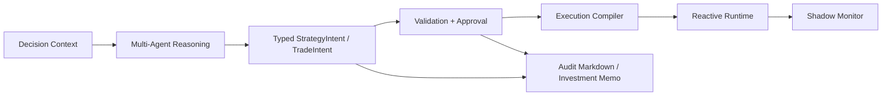

# Reactive Crypto Agentic DeFi System

**A safety-bounded, event-driven blueprint for AI-assisted DeFi execution.**  
**一个具备安全边界、事件驱动与条件执行约束的 AI 辅助 DeFi 系统蓝图。**

## Overview / 项目简介

This repository is an architecture-first blueprint for building a reactive, agentic DeFi system with clear decision boundaries, typed execution truth, and runtime safety controls. It is designed around one core idea: AI can help reason, compare, summarize, and form conditional intent, but it should not directly control funds, sign transactions, or improvise final execution payloads.

本仓库是一个以架构为先的蓝图，用于构建具备清晰决策边界、结构化执行真相与运行时安全约束的 reactive agentic DeFi 系统。它围绕一个核心思想展开：AI 可以参与研究、比较、总结与条件意图生成，但不应直接控制资金、签名交易，也不应在运行时自由拼装最终执行载荷。

In its current form, this repository is best understood as an implementation kit and system blueprint rather than a finished trading product. It combines modular knowledge files, implementation contracts, prompt templates, and an evolving Python codebase to make agent-driven DeFi execution more auditable, more constrained, and easier to reason about.

当前仓库更适合被理解为一个 implementation kit 与系统蓝图，而不是已经完成的交易产品。它将模块化知识库、implementation contract、prompt 模板以及逐步演进中的 Python 代码组合在一起，目标是让 agent 驱动的 DeFi 执行更可审计、更受约束，也更容易被工程化理解。

## Why This Project Exists / 为什么做这个项目

Many agentic trading demos are strong at analysis, but analysis alone is not execution truth. A natural-language thesis can be persuasive while still being unsafe, stale, or impossible to execute under real onchain conditions.

很多 agentic trading demo 很擅长“分析”，但分析本身并不等于执行真相。一个自然语言 thesis 即使看起来很有说服力，也可能在真实链上条件下变得不安全、过时，甚至根本无法执行。

This project exists to separate those layers. Research is one layer. Typed intent is another. Validation, approval, compilation, runtime constraints, and monitoring each get their own place in the system. The goal is not to let AI trade freely; the goal is to build a safer path from AI-assisted reasoning to conditional, auditable, bounded execution.

本项目的存在，就是为了把这些层次拆开。研究是一层，结构化意图是一层，校验、审批、编译、运行时约束与监控也各自有独立位置。目标不是让 AI 自由交易，而是搭建一条从 AI 辅助推理走向“条件化、可审计、受边界约束执行”的更安全路径。

## Core Principles / 核心原则

- **AI is bounded.** It can generate research, thesis, and conditional intent, but it cannot sign, hold funds, or generate final calldata.  
  **AI 受边界约束。** 它可以生成研究结论、thesis 与条件意图，但不能签名、托管资金，也不能生成最终 calldata。

- **Machine truth is structured.** Structured JSON is the single source of execution truth. Markdown is an audit excerpt, not the execution truth itself.  
  **机器真相必须结构化。** 结构化 JSON 是执行真相的唯一来源。Markdown 只是审计摘抄，不是执行真相本身。

- **Execution is conditional.** Onchain actions should be triggered under predefined constraints instead of being treated as free-form market orders.  
  **执行必须条件化。** 链上动作应在预定义约束下被触发，而不是被当作自由形式的即时下单。

- **RPC is authoritative.** The execution layer trusts RPC truth rather than third-party indexing APIs.  
  **RPC 是权威执行真相。** 执行层信任 RPC，而不是第三方索引 API。

- **Safety is split across time.** Checks happen both before registration and again at runtime through hard constraints.  
  **安全检查按时间拆分。** 安全校验既发生在注册前，也通过运行时硬约束再次执行。

- **Three output tracks coexist.** Machine Truth, Audit Markdown, and Investment Memo serve different audiences and must stay separate.  
  **三轨输出并存。** Machine Truth、Audit Markdown 与 Investment Memo 服务不同对象，必须严格分层。

## System Architecture / 系统架构



The system is meant to move from context collection to reasoning, from reasoning to typed intent, and from typed intent to validated and precompiled execution. Reactive components handle event-driven triggering, while shadow monitoring and exported artifacts make the system observable and auditable.

系统目标是把流程从上下文采集推进到推理，从推理推进到结构化意图，再从结构化意图推进到经过校验与预编译的执行。Reactive 组件负责事件驱动触发，Shadow Monitor 与导出产物负责保证系统可观测、可审计。

## What Makes It Different / 有何不同

- **Execution compiler at registration time.** This project pushes execution compilation earlier, so trigger-time behavior is constrained by precompiled rules rather than fresh free-form reasoning.  
  **在注册时完成执行编译。** 本项目把执行编译前移到注册阶段，让触发时行为由预编译规则约束，而不是依赖新的自由推理。

- **Typed intents instead of loose prompts.** Strategy and trade decisions are expected to land in strong typed objects instead of informal prose.  
  **使用强类型意图，而不是松散提示词结果。** 策略与交易决策应落到强类型对象中，而不是停留在非结构化文本里。

- **Validation and approval as first-class modules.** Strategy boundaries, approval surfaces, and pre-registration checks are part of the system design, not afterthoughts.  
  **把校验与审批视为一等模块。** Strategy boundary、approval surface 与注册前检查是系统设计的一部分，而不是事后补丁。

- **Reactive execution with stricter boundaries.** Reactive callbacks are used for deterministic triggering, not for giving AI free runtime control.  
  **Reactive 执行但边界更严格。** Reactive callback 用来做确定性触发，而不是把运行时自由控制权交给 AI。

- **Recovery and observability are built in.** Shadow monitoring, reconciliation, MEV protection assumptions, and `emergencyForceClose` are treated as core safety layers.  
  **恢复能力与可观测性内建。** Shadow Monitor、对账、MEV 防护假设以及 `emergencyForceClose` 被视为核心安全层。

## Inspirations / 灵感来源

This project draws inspiration from [CryptoAgents](https://github.com/sserrano44/CryptoAgents), [TradingAgents](https://github.com/TauricResearch/TradingAgents), and [reactive-smart-contract-demos](https://github.com/Reactive-Network/reactive-smart-contract-demos). It borrows the strengths of multi-agent market reasoning, crypto-native operator workflows, and Reactive execution patterns, then narrows them behind stronger execution boundaries and safety controls.

本项目从 [CryptoAgents](https://github.com/sserrano44/CryptoAgents)、[TradingAgents](https://github.com/TauricResearch/TradingAgents) 和 [reactive-smart-contract-demos](https://github.com/Reactive-Network/reactive-smart-contract-demos) 中获得灵感。它吸收了多 Agent 市场推理、crypto 原生操作者工作流以及 Reactive 执行模式的优势，并进一步将它们收束到更强的执行边界与安全控制之下。

## Repository Layout / 仓库结构

```text
backend/         Core runtime, CLI, decision, validation, execution, monitoring
docs/            Knowledge base, contracts, prompts, delivery documents
scripts/         Utility scripts and task-brief helpers
scaffold/        Reusable AGENTS and layout scaffolding
GitHubREADME/    GitHub-facing bilingual documentation
```

Key repository conventions:

- Start from `docs/knowledge/01_core/01_system_invariants.md` and `docs/knowledge/01_core/02_domain_models.md`
- Read the matching module contract before changing a module
- Treat module prompts as implementation constraints, not generic suggestions

关键仓库约定：

- 从 `docs/knowledge/01_core/01_system_invariants.md` 与 `docs/knowledge/01_core/02_domain_models.md` 开始
- 修改模块前，先读对应的 module contract
- 将模块 prompt 视为实现约束，而不是泛化建议

## Current Status / 当前阶段

- Architecture-first, blueprint-driven repository
- Core knowledge base and implementation contracts are already defined
- Python package wiring and CLI surfaces are partially implemented
- Reactive integration, execution compiler, and safety runtime are still being built out
- Not production-ready and not suitable for live capital without substantial further work

- 这是一个以架构优先、蓝图驱动的仓库
- 核心 knowledge base 与 implementation contract 已经定义
- Python 包装配与 CLI 表面能力已部分实现
- Reactive 集成、execution compiler 与安全运行时仍在建设中
- 当前并不具备生产可用性，也不适合未经大量补强后直接接入真实资金

## Technical Stack / 技术栈

- Python 3.10+
- Pydantic v2 for typed domain objects
- Typer + Rich for CLI interaction
- web3.py for onchain interaction
- SQLModel + SQLite as the default Phase 1 storage path
- APScheduler for background scheduling
- Foundry for contract development and testing

- Python 3.10+
- 使用 Pydantic v2 定义强类型领域对象
- 使用 Typer + Rich 构建 CLI 交互
- 使用 web3.py 进行链上交互
- Phase 1 默认采用 SQLModel + SQLite
- 使用 APScheduler 做后台调度
- 使用 Foundry 进行合约开发与测试

## Getting Started / 快速开始

The repository currently exposes a Python package with a CLI entrypoint. A minimal local setup looks like this:

当前仓库已经暴露出 Python package 与 CLI 入口。一个最小本地启动流程如下：

```powershell
python -m venv .venv
. .\.venv\Scripts\Activate.ps1
python -m pip install --upgrade pip
python -m pip install -e .
agent-cli --help
```

If you want to extend a module, follow this reading order before writing code:

如果你想扩展某个模块，请在动手前按下面顺序阅读：

1. `docs/knowledge/01_core/01_system_invariants.md`
2. `docs/knowledge/01_core/02_domain_models.md`
3. `docs/contracts/<module>.contract.md`
4. The matching module file under `docs/knowledge/`
5. `docs/prompts/<module>.prompt.md`

## Roadmap / 路线图

1. Finish typed `DecisionContext`, `StrategyIntent`, and `TradeIntent` flows
2. Connect multi-agent reasoning to stable structured outputs
3. Implement strategy boundary validation and pre-registration checks
4. Compile execution plans for Reactive-triggered entry and exit paths
5. Add shadow monitoring, reconciliation, and richer audit/export paths
6. Expand optional risk modules and cross-chain interface adapters

1. 完成 `DecisionContext`、`StrategyIntent` 与 `TradeIntent` 的强类型主链路
2. 将多 Agent 推理稳定接入结构化输出
3. 实现 strategy boundary 校验与注册前检查
4. 为 Reactive 触发的入场与出场路径编译 execution plan
5. 补齐 shadow monitor、对账与更完整的审计导出链路
6. 扩展可选风险模块与跨链接口适配层

## Disclaimer / 风险声明

This repository is for research, system design, and implementation planning. It is not financial advice, not a production custody system, and not a guarantee of safe autonomous trading. Do not connect it to real capital without substantial review, testing, contract validation, and operational controls.

本仓库用于研究、系统设计与实现规划。它不是投资建议，不是生产级托管系统，也不代表“安全自动交易”已经被证明成立。在经过充分评审、测试、合约验证与运维控制之前，请不要直接接入真实资金。
