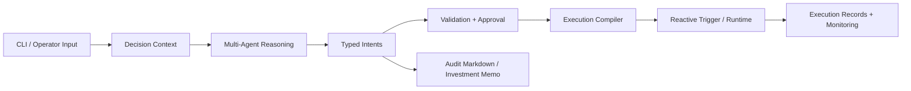

# Reactive Crypto Agentic DeFi System Prototype

**An end-to-end, runnable prototype for AI-assisted, safety-bounded DeFi system.**  
**一个可运行的端到端原型，用于构建具备安全边界的 AI 辅助 DeFi 系统。**

## Overview / 项目简介

This repository can be presented as a runnable end-to-end prototype for AI-assisted DeFi decision and execution workflows. It combines CLI-driven operator flow, multi-agent reasoning, typed decision artifacts, validation gates, execution compilation, and Reactive-style trigger logic into one architecture.

本仓库可以被呈现为一个可运行的端到端原型，用于承载 AI 辅助 DeFi 决策与执行工作流。它把 CLI 驱动的操作者流程、多 Agent 推理、结构化决策产物、校验关口、执行编译以及 Reactive 风格的触发逻辑组合到同一套架构中。

The prototype is designed to show how an AI-assisted DeFi system can move from research and conditional intent to constrained execution and monitoring without collapsing all responsibility into a single language-model step.

这个原型的目标，是展示 AI 辅助 DeFi 系统如何从研究与条件意图，推进到受约束的执行与监控，而不是把所有职责都压缩进单次语言模型输出里。

## What You Can Run / 现在可以跑什么

- A Python package with a CLI entrypoint for operator-facing workflows  
  一个带有 CLI 入口的 Python package，可用于面向操作者的工作流

- Modular decision, validation, execution, and monitoring surfaces organized under `backend/`  
  模块化的决策、校验、执行与监控能力，统一组织在 `backend/` 目录下

- Knowledge-driven implementation workflow through `docs/knowledge/`, `docs/contracts/`, and `docs/prompts/`  
  通过 `docs/knowledge/`、`docs/contracts/` 与 `docs/prompts/` 驱动的知识约束式实现流程

- An architecture that is already shaped as a full decision-to-execution loop, even as individual modules continue to mature  
  一套已经具备完整“决策到执行”闭环形态的架构，即便其中一些模块仍在持续完善

## End-to-End Flow / 端到端流程



This is the prototype story of the system: an operator initiates a workflow, the system builds a structured context, AI components produce typed strategy and trade intent, validation enforces boundaries, execution gets compiled ahead of time, and runtime logic reacts to conditions rather than improvising market actions in real time.

这就是系统的 prototype 叙事：操作者发起流程，系统构建结构化上下文，AI 组件生成结构化 strategy 与 trade intent，校验层负责施加边界，执行在前置阶段完成编译，运行时逻辑则根据条件触发，而不是在实时市场中临场自由生成动作。

## Why This Prototype Matters / 这个原型为什么重要

Most AI trading demos stop at analysis, chat, or loosely structured recommendations. This prototype is interesting because it tries to push one step further: from research output to bounded execution design.

大多数 AI trading demo 停留在分析、对话或较为松散的建议层。这个 prototype 更有意义的地方在于，它试图往前再走一步：从研究输出推进到“受约束的执行设计”。

Instead of treating language-model output as execution truth, the system insists on typed objects, validation layers, explicit approval surfaces, precompiled execution plans, and runtime monitoring. That makes the prototype useful not just as a demo, but as a concrete systems-thinking artifact.

它并不把语言模型输出直接当作执行真相，而是坚持通过强类型对象、校验层、显式审批界面、预编译执行计划以及运行时监控来完成收束。这让这个 prototype 不只是演示品，也是一份可以讨论和迭代的系统设计实体。

## Core Prototype Features / 原型核心特性

- **CLI-first operator workflow**  
  **CLI 优先的操作者工作流**  
  The system is organized around explicit command surfaces instead of hidden background automation.
  
  系统围绕明确的命令入口组织，而不是完全依赖不可见的后台自动化。

- **Multi-agent reasoning with typed outputs**  
  **多 Agent 推理 + 强类型输出**  
  AI reasoning is expected to land in typed domain objects such as `StrategyIntent`, `TradeIntent`, and related artifacts.
  
  AI 推理结果预期会落到 `StrategyIntent`、`TradeIntent` 等强类型领域对象中。

- **Validation and approval boundaries**  
  **校验与审批边界**  
  Strategy rules, approval surfaces, and pre-registration checks are treated as part of the primary flow.
  
  策略规则、审批界面和注册前检查被视为主流程的一部分。

- **Execution compilation before trigger time**  
  **在触发前完成执行编译**  
  Trigger-time execution is meant to follow constrained, precompiled logic rather than new ad hoc model outputs.
  
  触发时执行应遵循受约束的预编译逻辑，而不是新的临时模型输出。

- **Reactive runtime and monitoring path**  
  **Reactive 运行时与监控链路**  
  The architecture includes Reactive-style trigger handling, monitoring, and reconciliation concepts from the start.
  
  这套架构从一开始就纳入了 Reactive 风格的触发处理、监控与对账思路。

## What Makes This Prototype Different / 这个 Prototype 的差异点

- It treats AI as a bounded reasoning layer, not as an all-powerful runtime trader.  
  它把 AI 视为受边界约束的推理层，而不是全能的运行时交易者。

- It separates research, execution truth, audit artifacts, and investment memos into different outputs.  
  它把研究、执行真相、审计产物和投资 memo 拆成不同输出层。

- It pushes critical execution logic into typed schemas, validators, compilers, and runtime constraints.  
  它把关键执行逻辑前移到强类型 schema、validator、compiler 与运行时约束中。

- It includes monitoring and fallback thinking as part of the core prototype rather than an afterthought.  
  它把监控与兜底机制当作核心 prototype 的一部分，而不是后补思考。

## Inspirations / 灵感来源

This prototype is informed by [CryptoAgents](https://github.com/sserrano44/CryptoAgents), [TradingAgents](https://github.com/TauricResearch/TradingAgents), and [reactive-smart-contract-demos](https://github.com/Reactive-Network/reactive-smart-contract-demos). It combines multi-agent market reasoning, crypto-native workflow design, and Reactive execution patterns into a more execution-aware prototype.

这个 prototype 受到 [CryptoAgents](https://github.com/sserrano44/CryptoAgents)、[TradingAgents](https://github.com/TauricResearch/TradingAgents) 和 [reactive-smart-contract-demos](https://github.com/Reactive-Network/reactive-smart-contract-demos) 的启发。它把多 Agent 市场推理、crypto 原生工作流设计与 Reactive 执行模式组合到一个更强调执行边界的原型里。

## Repository Layout / 仓库结构

```text
backend/         CLI, decision, validation, execution, monitoring, adapters
docs/            Knowledge base, contracts, prompts, plans, testing notes
scripts/         Project utilities and helper scripts
scaffold/        Reusable templates and AGENTS scaffolding
GitHubREADME/    GitHub-facing bilingual README variants
```

## Quick Start / 快速开始

```powershell
python -m venv .venv
. .\.venv\Scripts\Activate.ps1
python -m pip install --upgrade pip
python -m pip install -e .
agent-cli --help
```

If you want to work on a specific module, the expected reading order is:

如果你要进入某个具体模块，建议按下面顺序阅读：

1. `docs/knowledge/01_core/01_system_invariants.md`
2. `docs/knowledge/01_core/02_domain_models.md`
3. `docs/contracts/<module>.contract.md`
4. The matching module knowledge file
5. `docs/prompts/<module>.prompt.md`

## Prototype Status / 原型状态

- Runnable and inspectable as a research-grade prototype
  这是一个可运行、可检查的 research-grade prototype
  
- Structured as a full end-to-end system, with some modules more mature than others
  它已经具备完整端到端系统结构，但各模块成熟度并不完全一致
  
- Suitable for architecture exploration, workflow design, and iterative implementation
  适合做架构探索、工作流设计与迭代实现
  
- Still experimental and not ready for unattended production capital deployment
  仍然属于实验性系统，不适合无人值守地直接部署真实资金

## Roadmap / 路线图

1. Stabilize typed decision outputs and validation contracts
   稳定结构化决策输出与校验契约
   
2. Tighten CLI approval and operator review surfaces
   强化 CLI 审批与操作者复核界面
   
3. Complete execution compiler and Reactive-trigger integration
   完成 execution compiler 与 Reactive trigger 集成
   
4. Expand monitoring, reconciliation, and export paths
   扩展监控、对账与导出链路
   
5. Add richer risk controls and optional cross-chain adapters
   增加更丰富的风险控制与可选跨链适配能力

## Disclaimer / 风险声明

This is a runnable prototype for research and system design. It is not investment advice, not a production custody platform, and not a guarantee of safe autonomous trading. Any real-capital use would require substantial additional testing, contract review, operational controls, and security hardening.

这是一个面向研究与系统设计的可运行 prototype。它不是投资建议，不是生产级托管平台，也不代表“安全自动交易”已经被验证成立。任何真实资金场景都需要额外的大量测试、合约审查、运维控制与安全加固。
