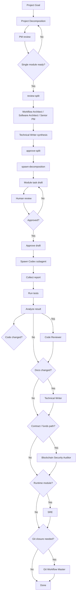

# Team Playbook

> 本文是本项目的 agent 编排工作流，不是实现计划。

**目标：** 用最小管理成本，让多个 agent 按模块、按门禁、按证据推进本项目。

## 0. 入口判定

- 如果任务可以唯一映射到一个现有 module_id，并且只需要这一模块的 `contract / prompt / knowledge`，直接进入模块级 workflow。
- 如果任务跨多个模块、无法唯一映射到单一模块、或必须先决定系统边界与依赖关系，先进入 `Project Decomposition` 阶段。
- 如果任务主要是补文档、模板、README、prompt、playbook，优先走文档阶段；只有文档依赖实现结果时，才回到模块级 workflow。
- 只要最终要改代码，就按 workflow 处理；只要不改代码，就按问答/调研处理。

**原则：**
- 单模块推进，禁止默认跨模块扩展
- 先读 `docs/knowledge/01_core/01_system_invariants.md`
- 再读 `docs/knowledge/01_core/02_domain_models.md`
- 再读对应 `docs/contracts/<module>.contract.md`
- 再读对应 `docs/knowledge/...` 模块文件
- 最后读对应 `docs/prompts/<module>.prompt.md`
- 未被文档定义的行为，必须保留 `TODO:` 或抛出明确异常
- `package` 是模块约束包装层，只负责收束可触碰范围与门禁
- 真实工作走 draft / approve / spawn-task 流程：draft 先自动补齐目标、验收、非目标、风险，人工 review 后 approve，再生成 module spawn payload
- 项目级拆分走 split / review-split / approve-split / spawn-decomposition：split 先生成拆分提案，approve-split 放行，spawn-decomposition 生成可直接喂给 Codex `spawn_agent` 的角色派工包

---

## 1. 角色分工

### 管理层
- `Product Manager`
  - 只负责任务卡草案与审批门
  - 任务卡来源必须是：用户目标 + invariants + domain models + module contract + module prompt
  - 输出固定为：`目标 / 验收标准 / 非目标 / 风险`

- `Agents Orchestrator`
  - 只负责编排、状态流转、门禁
  - 不改业务代码
  - 不允许并行推进多个模块

- `Senior Project Manager`
  - 负责把拆分结果转成可执行模块清单、里程碑和任务骨架
  - 不裁决代码边界

- `Workflow Architect`
  - 负责发现跨模块流程、拆分路径、handoff 和失败路径
  - 负责把大目标拆成阶段和候选模块

- `Software Architect`
  - 负责模块边界、依赖关系、接口裁决
  - 负责验证拆分方案是否可持续

### 开发层
- `Backend Architect`
  - 负责后端边界、服务层、接口契约

- `Data Engineer`
  - 负责 `DecisionContext`、provider 统一、数据契约

- `AI Engineer`
  - 负责结构化输出、trace、解析失败显式化

- `Solidity Smart Contract Engineer`
  - 负责合约、状态机、执行约束、逃生舱

- `Senior Developer`
  - 负责复杂实现、跨文件落地、架构决策的实现侧补位
  - 作为执行阶段的通用专家，不作为拆分阶段主裁决者

### 质量层
- `API Tester`
  - 负责一步一测，先跑最小相关测试

- `Test Results Analyzer`
  - 负责测试结果裁决，输出 Go / No-Go

- `Code Reviewer`
  - 负责代码审阅，重点看正确性、可维护性、测试覆盖和风险回归
  - 在测试通过后、文档收口前执行

- `Blockchain Security Auditor`
  - 负责合约与资金路径安全审计

- `SRE`
  - 负责运行态可靠性、监控、告警、稳定性

- `Git Workflow Master`
  - 负责分支、提交、PR、rebase、合并前的 Git 流程收口
  - 在交付前做 Git hygiene 检查，确保变更可回溯

### 文档层
- `Technical Writer`
  - 负责 markdown、README、prompt、playbook、变更说明等文档产物
  - 只有当任务包含文档交付时启用

### 执行补位门禁

- `Senior Developer`
  - 触发：实现涉及跨文件协作、已有实现需要补强，或主执行 agent 明显卡在工程实现细节上
  - 输入：任务卡、当前 diff、相关模块文件、测试反馈
  - 输出：实现建议、补丁方向、需要额外验证的风险点

- `Technical Writer`
  - 触发：实现影响文档、README、prompt、playbook、模板，或需要把提案收口成可审阅文本
  - 输入：实现结果、任务卡、contract 约束、拆分提案/模块报告
  - 输出：最终文档、提案正文、需要同步的文档差异清单

### 暂不作为主线默认编排
- `Reality Checker`
  - 当前项目主链路是后端、决策、合约、执行
  - 其偏视觉/前端证据链，不作为默认主验收

---

## 2. 任务卡定义

`Product Manager` 产出的单模块任务卡必须包含：

- `目标`
  - 来自用户当前需求
  - 来自模块 `contract` 的 `Scope` 和 `Definition of Done`

- `验收标准`
  - 来自模块 `Minimum Verification`
  - 来自模块 `prompt` 中的输出要求

- `非目标`
  - 来自模块 `Non-goals`
  - 来自 `system invariants` 的边界

- `风险`
  - 来自 `Hard Invariants`
  - 来自跨模块接口
  - 来自 contract 未定义但可能影响实现的点

任务卡必须是单模块的，不允许把多个模块塞进同一张卡。

`Project Decomposition` 产出的是模块拆分提案，不是任务卡：
- 输入：项目级目标、现有约束、模块边界信息
- 输出：候选模块清单、依赖顺序、边界说明、风险点
- 只有人工确认拆分结果后，才进入模块级 `draft`
- `split` 是 Project Decomposition 的执行入口。
- `review-split` 只负责查看拆分提案，不改状态。
- `approve-split` 是 Project Decomposition 的人工放行门。
- `spawn-decomposition` 负责把已批准的拆分提案整理成可直接交给 Codex `spawn_agent` 的角色派工包；bundle 会附带 `README.md`，Codex 会话可以先读 README 再按顺序读取角色文件。
- `Technical Writer` 负责最终汇总成对外可审阅的提案正文。

`package` 只负责模块约束包装，不改写任务语义。
`draft` 只负责从 contract 自动补齐 task card 草案，会同时输出重点摘要和完整版草案，不等于可执行任务。
`approve` 只负责确认人工 review 通过，再把草案转成 spawn payload。
`spawn-task` 负责把 task card 整理成适合 `spawn_agent` 的文本，不补充未定义行为。
`Code Reviewer` 在测试通过后审阅 diff。
`Git Workflow Master` 在交付前收口分支、提交和 PR 流程。

### 质量门禁

- `Code Reviewer`
  - 触发：代码已实现且最小测试通过
  - 输入：diff、测试结果、保持的不变量
  - 输出：审阅结论、问题列表、是否可进入收口阶段

- `Git Workflow Master`
  - 触发：模块准备交付或准备合并
  - 输入：分支状态、提交范围、PR 范围、剩余 review 意见
  - 输出：分支/提交/PR 流程建议、是否满足 Git hygiene

---

## 3. Workflow

### 固定门禁顺序
1. `Product Manager` 先定义项目目标和约束
2. `Workflow Architect` 先做项目拆分提案
3. `Software Architect` 审核模块边界与依赖关系
4. `Senior Project Manager` 把拆分结果转成模块清单和任务骨架
5. `split` 生成项目拆分提案
6. `review-split` 查看拆分提案
7. `Workflow Architect`、`Software Architect`、`Senior Project Manager` 先完成结构审查
8. `Technical Writer` 汇总成最终拆分提案
9. `approve-split` 放行拆分结果
10. `spawn-decomposition` 生成可直接喂给 Codex `spawn_agent` 的角色派工包
11. `Product Manager` 选定单一 module 并生成 task card 草案
12. 人工 review 草案，不通过就改回草案再看
13. `Product Manager` 用 `approve` 把已确认草案转成 spawn payload
14. `Agents Orchestrator` 把 spawn payload 交给 Codex `spawn_agent`
15. Codex subagent 按包内约束执行并回传 report
16. `API Tester` 先跑最小相关测试
17. `Test Results Analyzer` 判定是否继续
18. 如果任务改动代码，先过 `Code Reviewer`
19. 如果任务改动文档，`Technical Writer` 先收口文档版本
20. 涉及合约或资金路径时，加 `Blockchain Security Auditor`
21. 涉及运行态或监控时，加 `SRE`
22. 交付前由 `Git Workflow Master` 收口分支、提交和 PR 流程

---

## 4. 回报模板

所有 agent 的回报统一使用 [AGENT_REPORT_TEMPLATE.md](./AGENT_REPORT_TEMPLATE.md)。

禁止只回“已完成”。
禁止吞掉失败。
禁止用“看起来可以”替代测试结果。

任务卡统一使用 [TASK_CARD_TEMPLATE.md](./TASK_CARD_TEMPLATE.md)。

---

## 5. 首轮执行顺序

建议第一轮按 [FIRST_RUN_CHECKLIST.md](./FIRST_RUN_CHECKLIST.md) 推进。

## 6. 文档阶段

- 当模块实现伴随 `md`、README、prompt、playbook、模板类变更时，必须补文档阶段。
- 文档阶段由 `Technical Writer` 收尾，输出应和实现、任务卡、contract 保持一致。
- 如果只是改实现而不改文档，文档阶段可以跳过。

---

## 7. 测试规则

- 每个任务先跑最小相关测试
- 失败只回滚当前模块
- 不通过测试，不进入下一个模块
- 合约变更必须过安全审计
- 运行态变更必须过可靠性检查

---

## 8. 约束摘要

- AI 不直接控制资金
- AI 不直接生成最终 calldata
- AI 不直接签名
- Reactive 只做事件驱动和 callback，不做自由决策
- 只做条件触发，不做即时市价执行
- 执行真相唯一来源是结构化 JSON
