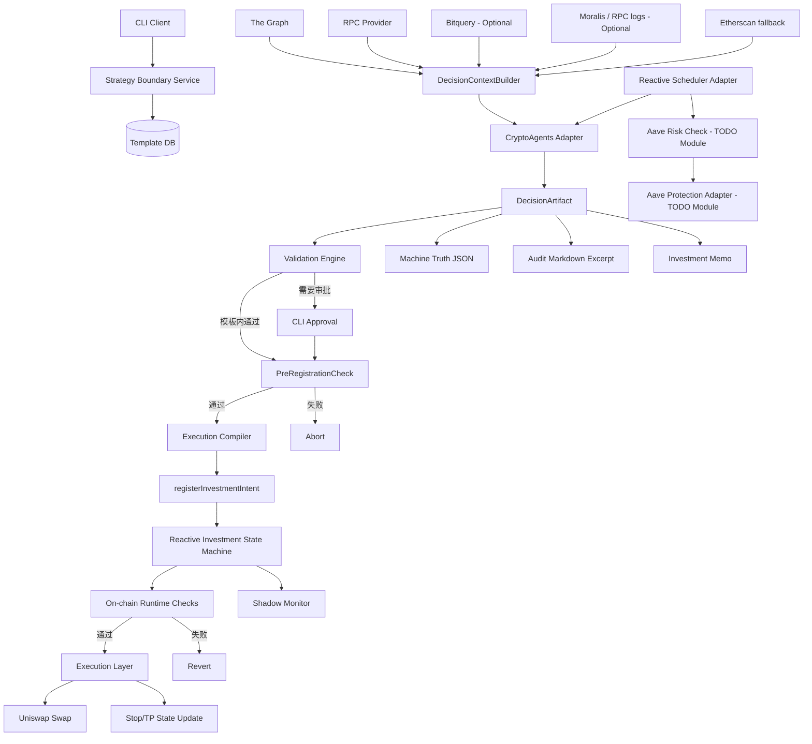
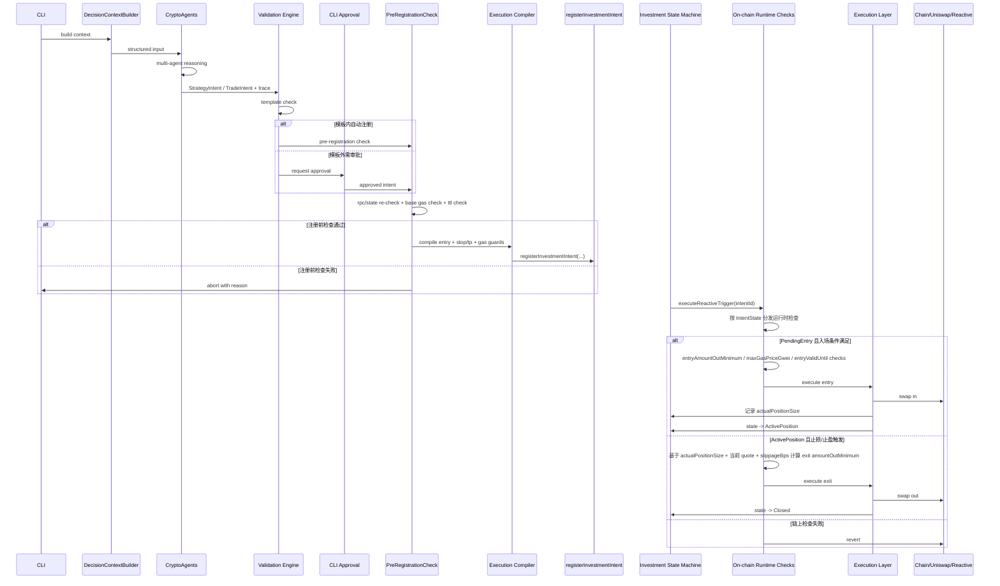

# PRD：基于 CryptoAgents 的单链 DeFi 自动交易系统（CLI 终版 v10｜投资型升级 + 纯链上闭环 + 精益工程实现）

## 1. 产品概述

### 1.1 产品目标
构建一个**基于 CryptoAgents 的单链 DeFi 自动交易系统（CLI 形态）**，实现以下闭环：

- 多智能体决策：使用 CryptoAgents 作为决策编排底座。CryptoAgents 明确定位为面向加密货币交易的多智能体 LLM 框架，包含 analyst、research debate、risk management 和 portfolio management 等角色，并提供交互式 CLI。
- 人机协同约束：用户不直接写 JSON，而是通过策略配置流程定义边界，系统内部固化为模板。
- 自动执行：单链 Uniswap 条件执行。
- 自动保护：Reactive stop-loss / take-profit。
- 链上状态机：Reactive Investment Position State Machine（投资仓位状态机）。
- 可审计输出：结构化 JSON + Markdown 摘抄文件。
- 投研输出：Investment Memo / 投资分析报告。
- 未来扩展：为 Hyperlane 与 gasless-cross-chain-atomic-swap 预留跨链接口，但 **Phase 1 不实现跨链**。

### 1.2 产品范围
**Phase 1 范围**
- 单链，建议 Ethereum 或 Base
- 单 DEX，建议 Uniswap V2/V3
- CLI-only
- CryptoAgents 决策
- 策略模板校验
- PreRegistrationCheck
- Execution Compiler
- Reactive 纯链上条件执行（投资仓位状态机）
- 执行 + stop/tp
- Approval 流与 Shadow Monitor
- Aave 风控作为**旁路 TODO 模块**，不阻塞主链路上线

**明确不做**
- Web UI
- 多链实装
- HFT
- 主动 MEV Extraction
- 自动资金跨链
- RL 策略进化

### 1.3 产品定位（关键升级）
本系统从“AI 自动交易系统”升级为：

> **AI 投研 + 条件执行驱动的链上投资系统**

CryptoAgents 的角色从：
- 交易员（直接下单）

升级为：
- 投资产品经理 / 投研负责人（制定策略、输出 thesis、形成投资备忘录）

### 1.4 核心原则
1. 执行真相唯一来源是结构化 JSON。
2. Markdown 审计副本只做摘抄，不做总结生成。
3. Investment Memo 允许基于结构化结果和推理过程生成分析报告。
4. 执行层只信 RPC，不信第三方索引 API。
5. AI 不直接控制资金，不直接生成最终 calldata，不直接签名。
6. 所有交易必须先经过策略模板与注册前二次确认。
7. 所有执行为条件触发（非即时市价执行）。
8. Reactive 负责事件驱动、条件触发和 callback，不负责自由决策。
9. 系统必须内建 **MEV Protection**，Phase 1 不做 **MEV Extraction**。
10. 三轨输出并存：Machine Truth / Audit Markdown / Investment Memo。
11. 执行编译器工作于**注册时**，不是触发时。
12. 安全检查必须拆分为：**链下注册前检查** + **链上运行时硬约束**。
13. 智能合约架构采用 **Investment Position State Machine**，不采用“链上只发信号、链下再执行”的混合模式。
14. Shadow Monitor 必须独立于 Reactive 运行，并使用备用 RPC 做状态对账与高危报警。
15. 合约必须预留 `emergencyForceClose` 逃生舱，用于极端情况下强制平仓。
16. 工程实现遵循 **Library-First、Lean Defensive Coding、TODO Strategy**。

## 2. 参考仓库与许可

### 2.1 参考仓库
- CryptoAgents：多智能体加密交易框架，Apache-2.0，且 README 明确说明其是对 TradingAgents 的重度编辑 fork。仓库地址：<https://github.com/sserrano44/CryptoAgents>
- TradingAgents：多智能体金融交易框架，Apache-2.0。仓库地址：<https://github.com/TauricResearch/TradingAgents>
- Reactive smart contract demos：用于 CRON、Uniswap stop-loss/take-profit、Aave protection、Approval Magic、Hyperlane 等模式参考。仓库地址：<https://github.com/Reactive-Network/reactive-smart-contract-demos>

### 2.2 许可要求
- CryptoAgents：Apache-2.0。
- TradingAgents：Apache-2.0。
- Reactive demos：在实际复用代码前，需在实现阶段再次核验仓库 LICENSE 文件并保留原版权与引用说明。当前 PRD 只将其作为模式参考和适配来源。

## 3. 总体架构

### 3.1 Module Relationship Diagram



### 3.2 架构说明
- `Validation -> Execution` 不再直接串联，而是改为：`Validation -> PreRegistrationCheck -> Execution Compiler -> registerInvestmentIntent -> Investment State Machine -> On-chain Runtime Checks -> Execution`。
- Decision 层与 Execution 层通过 `StrategyIntent`、`TradeIntent`、`ExecutionPlan` 解耦。
- 输入层采用“多源 API + 轻量特征层 + 统一 ContextBuilder”，不是重写整套输入系统，而是在 CryptoAgents 既有输入骨架上做适配。
- 输出层不再只有“审计副本”。现在严格拆为：
  - Machine Truth：执行真相
  - Audit Markdown：摘抄审计副本
  - Investment Memo：面向用户/投委会的投研报告
- Execution Compiler 是新增桥接层，负责在**注册时**，根据 `TradeIntent` 及当时链上状态，预先生成可执行 calldata 和硬约束参数。
- Reactive 合约不再只是简单触发器，而是维护 `PendingEntry -> ActivePosition -> Closed` 的**投资仓位状态机**。
- 运行时的安全边界不再依赖链下参与，而是由状态机 Callback 合约中的 `require` 语句强制执行。

## 4. 核心数据流

### 4.1 Critical Sequence Diagram



## 5. 功能拆分

### 5.1 决策层：CryptoAgents Adapter
职责：
- 调用 CryptoAgents 多角色流程
- 保留 analyst / research / risk / portfolio 的多智能体推理骨架
- 输出结构化 `DecisionArtifact`
- 输出长期投资 thesis 和 Investment Memo
- 不直接输出最终可执行 calldata

不再负责：
- 即时交易
- 直接下单
- 直接编码合约参数

#### 5.1.1 可 100% 迁移的核心资产（直接复用）
基于 CryptoAgents（以及其上游 TradingAgents）的现有实现，下列能力可直接迁移，不需要重写底盘：

1. **多角色辩论机制（Research Debate Framework）**
   - 保留 Analyst / Risk Manager / Portfolio Manager 等多角色协作与审阅流转机制。
   - 这套多 Agent 协作框架与当前 PRD 中“投研出报告、风控卡预算、组合经理形成最终条件意图”的逻辑天然一致。

2. **投资组合状态注入（Portfolio State Injection）**
   - 原框架已具备将 Cash / Holdings / 历史盈亏注入 Agent 上下文的能力。
   - 在本项目中直接映射到 `DecisionContext.position_state`。

3. **Agent 原始推理痕迹捕获（Agent Trace）**
   - 原框架对各 Agent 的中间输出、推理痕迹和对话流已有较成熟的组织方式。
   - 本项目直接复用，用于：
     - `AgentTrace`
     - `Audit Markdown`
     - `Investment Memo` 的论据素材

#### 5.1.2 借壳改造路径（推荐实施策略）
本项目不从零手写大模型编排层，而是采用：

> **Fork CryptoAgents，保留编排底盘，替换传感器（输入数据）和方向盘（输出目标）**

具体实施：
- 保留其多 Agent 聊天 / 辩论 / 角色流转循环；
- 保留其 CLI 交互骨架；
- 替换其 `data_fetcher` / 数据接入层；
- 重写最终 `Portfolio Manager` Prompt，使其从“Buy/Sell/Hold 自由文本”切换为“条件意图 JSON + thesis”。

#### 5.1.3 Prompt 框架重构（重度魔改）
原版 Prompt 更偏“现在买 / 现在卖 / 现在观望”的短线交易员范式。  
本项目中必须将最终决策 Prompt 改写为：

- 不输出 Market Order 自由文本
- 不输出即时执行建议
- 强制输出 **Conditional Intent**
- 强制输出 **Structured Output JSON**

新的 Prompt 约束要点：
- 必须给出合理的 `trigger_price_max` / `trigger_price_min`
- 必须给出 `valid_until_sec`
- 必须给出 `max_slippage_bps`
- 必须给出 `stop_loss_bps` / `take_profit_bps`
- 必须输出 `investment_thesis`

推荐让 Portfolio Manager 输出一个“组合对象”，而不是把所有信息直接塞进执行 JSON：

```json
{
  "trade_intent": {
    "pair": "WETH/USDC",
    "side": "buy",
    "size_pct_nav": 0.05,
    "entry_conditions": {
      "trigger_price_max": 3000.0,
      "valid_until_sec": 86400
    },
    "max_slippage_bps": 50,
    "stop_loss_bps": 300,
    "take_profit_bps": 1000
  },
  "investment_thesis": "ETH 跌破关键位后可能出现流动性错杀与清算级黄金坑，因此采用条件挂单而非追涨。"
}
```

说明：
- `trade_intent` 进入执行链路；
- `investment_thesis` 进入 `DecisionMeta` / `Investment Memo`；
- 执行层仍然只读取结构化执行字段，不读取自由文本。
- 结构化输出必须以 **Pydantic v2 模型** 为单一真相源；若所选模型提供原生 Structured Outputs，则优先使用原生能力；否则使用 `Instructor` 进行约束输出。

### 5.2 输入层：DecisionContextBuilder
职责：
- 从多数据源取数
- 做轻量特征工程
- 统一上下文结构
- 屏蔽底层 provider 差异

新增原则：
- 输入数据从“tick 级交易噪声”转向“趋势级、条件级、资金流级”信号
- 以小时线 / 日线、资金流趋势、链上行为模式为主
- 避免把短时间状态漂移极大的微观数据直接交给慢推理链路

#### 5.2.1 输入视角改造：从短线交易员到机构级长线投研
原版 CryptoAgents 的默认输入倾向更接近高频/短线交易员，例如：
- 高频 OHLCV
- 短周期 RSI
- 订单簿深度
- 1m/5m 微观价格波动

本项目需要把输入视角上移到更适合长期条件投资的层次。

**原版输入倾向示例**
```json
{
  "current_price": 3050.5,
  "1m_candles": [],
  "order_book_depth": {"bids": [], "asks": []},
  "rsi_15m": 65
}
```

**本项目适配后的输入框架**
```json
{
  "macro_market": {
    "current_price": 3050.5,
    "daily_ma_50": 3100,
    "daily_ma_200": 2800,
    "implied_volatility_7d": 0.45
  },
  "onchain_flow": {
    "dex_volume_24h_trend": "increasing",
    "large_transfers_inflow_net": "+5000 ETH",
    "tvl_change_7d_pct": 2.5
  },
  "risk_environment": {
    "aave_borrow_rate_weth": 0.035,
    "network_base_fee_gwei": 15
  },
  "portfolio_state": {
    "nav_usdt": 100000,
    "current_exposure_pct": 0.2
  }
}
```

结论：
- 减少 tick 级与订单簿级噪声依赖；
- 增强趋势、资金流、风险环境、组合状态输入；
- 更符合“投研大脑 + 条件执行肌肉”的系统定位。

### 5.3 约束层：Strategy Boundary Service
职责：
- 创建/修改/查看策略模板
- 模板版本管理
- 约束边界校验
- 决定自动注册、人工审批或拒绝

### 5.4 校验层：Validation Engine
职责：
- 校验 `StrategyIntent` / `TradeIntent` 是否在模板范围内
- 输出 `ValidationResult`
- 不执行链上状态确认

强制约束：
- **禁止手写字典字段检查和散落的 `if a > b` 校验逻辑**。
- 所有校验必须基于 **Pydantic v2** 模型完成，使用：
  - 字段类型约束
  - `field_validator` / `model_validator`
  - `ValidationError`
- `StrategyTemplate`、`StrategyIntent`、`TradeIntent`、`ExecutionPlan`、`ApprovalBattleCard` 等核心对象必须全部映射为 Pydantic Models。
- Validation Engine 的职责是：
  1. 接收 Pydantic 解析后的强类型对象；
  2. 调用模型级 validator；
  3. 抛出明确的 `ValidationError` 或领域异常。

不允许：
- 在业务层重复发明 schema 校验逻辑；
- 在多个模块中各自维护一套“边界比较 if/else”。

### 5.5 注册前安全层：PreRegistrationCheck（重命名）
职责：
- 用 RPC 做注册前状态确认
- 重新确认储备、基准滑点、余额、allowance、基准 gas、health factor 等
- 计算盈亏平衡点（Break-even）
- 校验 Gas 成本占比（Gas / Expected Profit）
- 校验 TTL 是否仍有效
- 决定是否允许注册 Reactive 条件单

新增规则：
```text
if gas_cost > expected_profit * threshold:
    abort
```

说明：
- 防止“小仓位 + 高 gas”直接把收益吃光
- 与 `StrategyIntent.risk_budget_pct` 联动
- 这里只校验**注册时**的可行性，不承担运行时最终防守职责

### 5.6 Execution Compiler（新增）
职责：
- 将 `StrategyIntent` / `TradeIntent` 编译为 `ExecutionPlan`
- 在**注册时**基于当时链上状态生成 calldata
- 预先写死以下**入场阶段**链上硬约束参数：
  - `entryAmountOutMinimum`
  - `maxGasPriceGwei`
  - `entryValidUntil`
- 预先写死以下**出场阶段**相对约束参数：
  - `stopLossSlippageBps`
  - `takeProfitSlippageBps`
- 将意图层与执行层隔离
- 将单笔条件单升级为“投资仓位状态机”的完整注册载荷

说明：
- calldata 不由 AI 生成
- 不在触发时执行编译，避免把链下延迟重新引入触发链路
- 编译器在注册时只对**入场**相关绝对约束做一次性计算
- 对于止损/止盈，编译器不在入场前预计算绝对 `amountOutMinimum`，而是把**滑点容忍比例（BPS）**上链
- 合约在入场成功时记录真实买入数量 `actualPositionSize`，并在未来出场触发时，基于 `actualPositionSize + 当前 quote + slippageBps` 动态计算最小可接受输出
- 是纯链上闭环成立的关键桥接层
- **核心业务函数内禁止用局部 try/except 吞异常**，失败应快速抛出领域异常，由 CLI 主循环或全局错误边界统一处理。

### 5.7 执行层：Execution Layer（重构）
职责：
- 不再在校验通过后立即 swap
- 只在 Reactive 条件触发并通过链上运行时检查后执行
- 负责实际链上调用和回执落库

### 5.8 Reactive 层（扩展）
职责：
- 定时触发（Cron）
- 入场（Limit / Conditional Entry）
- 出场（StopLoss / TakeProfit）
- Approval Magic 自动化
- 维护投资仓位状态流转

新增说明：
- Reactive 成为统一执行引擎，而不仅仅是“出场保护层”
- Phase 1 采用纯链上闭环，不把 Reactive 降级成“链上发信号、链下再执行”的预警机
- Reactive 合约在本架构中不是简单 Trigger，而是 `PendingEntry -> ActivePosition -> Closed` 的**Investment Position State Machine**
- Aave Protection 不作为 Phase 1 主链路阻塞项，而是独立旁路 TODO 模块

### 5.9 Investment Position State Machine Contract（新增核心合约）
职责：
- 把单笔条件单升级为“投资仓位状态机”
- 在同一个 Intent 中同时维护：
  - 入场触发条件
  - 入场滑点死线
  - 入场 TTL
  - 入场阶段 Gas 死线
  - 止损参数
  - 止盈参数
  - 实际持仓量
  - 当前状态

建议接口契约如下：

```solidity
// SPDX-License-Identifier: MIT
pragma solidity ^0.8.0;

interface IReactiveInvestmentCompiler {
    enum IntentState { PendingEntry, ActivePosition, Closed }

    struct InvestmentIntent {
        address tokenIn;
        address tokenOut;
        uint256 amountIn;

        // 入场参数
        uint256 entryTriggerPrice;
        uint256 entryAmountOutMinimum;
        uint256 entryValidUntil;
        uint256 maxGasPriceGwei;

        // 出场参数：不用绝对 minOut，改传相对滑点比例
        uint256 stopLossPrice;
        uint256 stopLossSlippageBps;
        uint256 takeProfitPrice;
        uint256 takeProfitSlippageBps;

        // 入场成功后由合约记录
        uint256 actualPositionSize;

        IntentState state;
    }

    function registerInvestmentIntent(InvestmentIntent calldata intent) external returns (uint256 intentId);
    function executeReactiveTrigger(uint256 intentId) external;

    function emergencyForceClose(uint256 intentId, uint256 maxSlippageBps) external;
}
```

#### 5.9.1 状态机流转
- 初始状态：`PendingEntry`
- 第一次触发：若入场条件满足，则执行入场，状态流转到 `ActivePosition`
- 入场成功后，合约记录 `actualPositionSize`
- 第二次触发：若止损或止盈条件满足，则基于 `actualPositionSize` 计算出场最小可接受输出并执行出场，状态流转到 `Closed`
- `Closed` 状态下不得再次触发执行

#### 5.9.2 链上运行时硬防守
职责：
- 在触发瞬间于链上执行不可绕过的最后防线
- 运行时检查必须**按状态机分作用域**，不能无差别施加到所有状态

**PendingEntry（入场阶段）检查：**
```solidity
require(amountOut >= params.entryAmountOutMinimum, "Slippage exceeded/MEV attacked");
require(tx.gasprice <= params.maxGasPriceGwei, "Gas fee too high at entry");
require(block.timestamp <= params.entryValidUntil, "Entry TTL expired");
```

**ActivePosition（出场阶段）检查：**
```solidity
uint256 exitAmountOutMinimum = quoteOut(params.actualPositionSize) * (10_000 - slippageBps) / 10_000;
require(amountOut >= exitAmountOutMinimum, "Exit slippage exceeded");
```

说明：
- 这是防 MEV、极端行情、幽灵订单的最终保障
- 属于 On-chain Runtime Check，而非链下 PreRegistrationCheck
- `maxGasPriceGwei` 与 `entryValidUntil` **仅作用于 PendingEntry（入场阶段）**
- 一旦状态进入 `ActivePosition`，止损/止盈是“逃命”或“止盈落袋”动作，不能再被入场阶段的 Gas 预算或 TTL 死线拦截
- 对于状态机模式，入场和止损/止盈分别使用不同的约束逻辑

#### 5.9.3 Emergency Force Close（新增）
当 Shadow Monitor 发现“该死却没死”的异常状态，并且超过容忍度缓冲（Grace Period）后，系统必须允许管理员通过 CLI 直接调用链上逃生舱：

```solidity
function emergencyForceClose(uint256 intentId, uint256 maxSlippageBps) external onlyOwner
```

核心要求：
- 仅允许 owner / authorized relayer 调用
- 调用前必须确认当前 `IntentState == ActivePosition`
- 在执行紧急卖出前，先将状态强制改为 `Closed`
- 紧急卖出使用更宽的滑点容忍，以“逃命优先”为原则
- 任何后续迟滞到达的 Reactive 正常回调，都必须因为状态不再是 `ActivePosition` 而直接 Revert

工程收益：
- 解决 Callback 迟滞时的并发竞争与重复平仓风险
- 让人工干预成为“最后一道活命手段”，而不是日常执行路径

### 5.10 导出层：Export / Markdown Excerpt
职责：
- 导出 JSON
- 导出 Audit Markdown 摘抄
- 导出 Investment Memo
- Audit 不做自由文本改写

### 5.11 CLI 层
职责：
- 策略管理
- 决策运行
- 审批
- 执行查询
- 导出记录
- 高危告警与强制人工动作（如手动平仓）

### 5.12 Shadow Monitor（新增）
职责：
- 监控 Reactive Trigger 是否迟滞
- 监控 stop-loss / take-profit 是否已被击穿但 callback 未执行
- 向 CLI 发出高危警报
- 允许人工干预执行

运行原则：
- 它是一个独立于主业务进程的轻量级 Daemon / Cron Job
- 它不依赖 Reactive 网络状态，而是依赖**备用 RPC**做状态对账
- 它遵循“只看不摸，除非报警”的原则

#### 5.12.1 非对称监听机制
Shadow Monitor 每隔 N 个区块轮询一次状态为 `ActivePosition` 的意图，并向备用 RPC 发起两类查询：
1. 当前预言机 / 池子价格是否已击穿止损线或突破止盈线；
2. 合约内该 Intent 的状态是否仍为 `ActivePosition`。

若价格条件已满足，但合约状态在多个区块后仍未变化，则视为 Reactive 回调迟滞。

#### 5.12.2 Grace Period（优雅容忍）
为避免与正常回调并发冲突，Monitor 不应在价格刚击穿的瞬间立刻报警。

规则：
- 默认给予一个容忍缓冲，例如 **3 个区块或 1 分钟**
- 若在 Grace Period 结束后，Intent 状态仍未变更，则升级为最高级别警报

#### 5.12.3 高危报警与人工接管
达到最高级别警报后：
- Phase 1 必须在 CLI 终端醒目渲染高危警报；
- 当前阶段仅做 **Stdout 打印 + 日志落盘**；
- **TODO：后续 Sprint 再接入 Telegram / Discord / 钉钉 Webhook 异步通知模块**；
- CLI 应支持立即执行 `agent-cli execution force-close <intent-id>`；
- 警报信息必须说明：
  - 当前状态
  - 价格已击穿/突破的情况
  - 额外损失估算
  - 建议的紧急动作

## 6. Core Abstractions and Primary Data Structures

### 6.1 DecisionContext
统一决策输入。

```json
{
  "market": {},
  "liquidity": {},
  "onchain_flow": {},
  "risk_state": {},
  "position_state": {},
  "strategy_constraints": {},
  "execution_state": {
    "reserve_snapshot": "",
    "expected_slippage": "",
    "gas_estimate": "",
    "health_factor": ""
  }
}
```

说明：
- `execution_state` 由 RPC 提供，仅用于辅助 agent 判断与注册前检查，不能替代最终链上确认。

### 6.2 StrategyTemplate
策略模板，内部真相对象。

```json
{
  "template_id": "tpl_001",
  "name": "eth-breakout-v1",
  "chain_id": 1,
  "allowed_pairs": ["WETH/USDC"],
  "allowed_dex": ["uniswap_v2"],
  "max_position_pct_nav": 0.05,
  "max_slippage_bps": 80,
  "stop_loss_min_bps": 200,
  "stop_loss_max_bps": 500,
  "take_profit_min_bps": 400,
  "take_profit_max_bps": 1200,
  "max_daily_trades": 3,
  "max_daily_loss_pct_nav": 0.03,
  "execution_mode": "auto",
  "manual_review_if_out_of_bounds": true,
  "status": "active",
  "version": 1
}
```

### 6.3 StrategyIntent（新增）
长期投资目标的上层抽象。

```json
{
  "strategy_id": "strat_001",
  "asset": "WETH",
  "allocation_target_pct": 0.15,
  "accumulation_window_days": 14,
  "entry_style": "laddered",
  "risk_budget_pct": 0.03,
  "exit_conditions": {
    "hard_stop_loss_bps": 1200
  }
}
```

说明：
- `StrategyIntent` 描述长期目标和风险预算
- 一个 `StrategyIntent` 可拆解为多个 `TradeIntent`

### 6.4 TradeIntent
执行真相的主对象（升级为“条件意图”）。

```json
{
  "intent_id": "intent_002",
  "pair": "WETH/USDC",
  "side": "buy",
  "size_pct_nav": 0.05,
  "entry_conditions": {
    "trigger_price_max": 3050,
    "trigger_price_min": null,
    "valid_until_sec": 1711756800
  },
  "max_slippage_bps": 80,
  "stop_loss_bps": 300,
  "take_profit_bps": 800,
  "time_in_force_sec": 21600,
  "chain_id": 1,
  "target_chain_id": null,
  "crosschain": false
}
```

关键变化：
- 从即时市价单升级为条件单
- 增加 `entry_conditions`
- 增加 TTL
- 强制包含 `max_slippage_bps`

### 6.5 ExecutionPlan（新增）
执行计划对象。

```json
{
  "execution_plan_id": "plan_001",
  "intent_id": "intent_002",
  "execution_style": "investment_position_state_machine",
  "compiled_at_registration": true,
  "register_payload": {
    "entryTriggerPrice": 3050,
    "entryAmountOutMinimum": "precomputed",
    "entryValidUntil": 1711756800,
    "maxGasPriceGwei": 5,
    "stopLossPrice": 2950,
    "stopLossSlippageBps": 80,
    "takeProfitPrice": 3350,
    "takeProfitSlippageBps": 80
  }
}
```

说明：
- 由 Execution Compiler 在注册时生成
- 不是在触发时再编译
- 是“执行计划”，不是最终交易结果
- 其本质是对 `InvestmentIntent` 合约载荷的链下编译结果
- 止损/止盈阶段不在注册时预计算绝对 `amountOutMinimum`，而是预先写入相对滑点容忍度，等待合约在出场触发时结合 `actualPositionSize` 动态计算

### 6.5.1 InvestmentIntent（链上状态机结构）
链上注册载荷对象，对应 `IReactiveInvestmentCompiler.InvestmentIntent`。

```solidity
enum IntentState { PendingEntry, ActivePosition, Closed }

struct InvestmentIntent {
    address tokenIn;
    address tokenOut;
    uint256 amountIn;
    uint256 entryTriggerPrice;
    uint256 entryAmountOutMinimum;
    uint256 entryValidUntil;
    uint256 maxGasPriceGwei;
    uint256 stopLossPrice;
    uint256 stopLossSlippageBps;
    uint256 takeProfitPrice;
    uint256 takeProfitSlippageBps;
    uint256 actualPositionSize;
    IntentState state;
}
```

说明：
- `PendingEntry`：尚未入场
- `ActivePosition`：已入场，等待止损/止盈触发
- `Closed`：仓位已平，禁止再次触发
- `actualPositionSize` 在入场成功后由合约记录，用作未来出场的本金基数
- `maxGasPriceGwei` 与 `entryValidUntil` 只约束入场阶段
- 出场阶段使用 `actualPositionSize + 当前 quote + slippageBps` 计算最小可接受输出

### 6.6 DecisionMeta
附加元信息。

```json
{
  "confidence": 0.74,
  "risk_mode": "moderate",
  "thesis": "bullish breakout with rising liquidity"
}
```

### 6.7 AgentTrace
原始推理痕迹，只读，不再加工。

```json
{
  "agents": [
    {"name": "Market Agent", "excerpt": "bullish breakout detected"},
    {"name": "Liquidity Agent", "excerpt": "liquidity rising in last 30m"}
  ]
}
```

### 6.8 ValidationResult
模板校验结果。

```json
{
  "status": "passed",
  "requires_manual_approval": false,
  "violations": []
}
```

### 6.9 ExecutionRecord
执行结果真相。

```json
{
  "status": "executed",
  "swap_tx_hash": "0x...",
  "stop_loss_registered": true,
  "take_profit_registered": true
}
```

### 6.10 DecisionArtifact
统一中间产物。

```python
DecisionArtifact
├── strategy_intent
├── trade_intent
├── execution_plan
├── decision_meta
├── agent_trace
├── validation_result
├── execution_record
```

### 6.11 MarkdownExcerpt
Markdown 摘抄规则对象，定义允许导出的字段和顺序。

### 6.12 PortfolioManagerOutput（新增）
Portfolio Manager 的原始结构化输出建议采用组合对象，而不是让执行字段与报告字段混杂：

```json
{
  "trade_intent": {
    "pair": "WETH/USDC",
    "side": "buy",
    "size_pct_nav": 0.05,
    "entry_conditions": {
      "trigger_price_max": 3000.0,
      "valid_until_sec": 86400
    },
    "max_slippage_bps": 50,
    "stop_loss_bps": 300,
    "take_profit_bps": 1000
  },
  "investment_thesis": "ETH 跌破关键位后可能出现条件性抄底机会。"
}
```

说明：
- `trade_intent` 进入执行链路；
- `investment_thesis` 进入 `DecisionMeta` 和 `Investment Memo`；
- 避免把报告文本混入执行真相。

### 6.13 ApprovalBattleCard（新增）
CLI 审批阶段的人类可读视图模型，由结构化对象映射生成，不允许直接拼接原始 JSON 原文。

```json
{
  "intent_id": "intent_002_weth_dip",
  "strategy_template": "eth-macro-accumulation-v1",
  "intercept_reason": "预估 Gas 成本占比过高",
  "thesis_excerpt": "宏观趋势显示 ETH 在 3050 附近有强力买盘...",
  "execution_summary": {
    "action": "BUY WETH with USDC",
    "capital_usdt": 5000,
    "allocation_pct_nav": 0.05,
    "trigger_price": 3050
  },
  "onchain_constraints": {
    "amount_out_minimum": "1.631 WETH",
    "max_gas_price_gwei": 25,
    "ttl_remaining": "23h45m"
  },
  "risk_reward": {
    "stop_loss_trigger": 2950,
    "max_drawdown_usdt": 160,
    "take_profit_trigger": 3300,
    "expected_profit_usdt": 410
  }
}
```

说明：
- `ApprovalBattleCard` 不是执行真相，不入链，不替代 `TradeIntent`。
- 它是 CLI 审批层的显示对象。
- 它必须从 `TradeIntent`、`ExecutionPlan`、`ValidationResult`、`DecisionMeta` 和 `ExecutionCompiler` 预计算结果映射而来。
- 不允许 LLM 在审批时重新自由生成战报正文。

## 7. 输入层设计与数据来源

### 7.1 设计原则
- 不重写 CryptoAgents 输入骨架，只在其外部增加统一 provider 和 `DecisionContextBuilder`
- API 优先，降低开发压力
- Feature 工程先轻量化，不一开始自建重型数据平台
- 执行层真相只来自 RPC
- 输入数据从微观噪声转向趋势级 / 资金流级 / 风险级信号
- **禁止裸写 HTTP 请求**：
  - `rpc_provider` 必须使用 `web3.py`
  - `graph_provider` 必须使用 `gql`
  - 第三方 API 若有官方 Python SDK 优先使用
  - 若无官方 SDK，统一走共享的 `httpx` client
- **禁止在各 provider 中重复实现网络重试逻辑**，统一放在共享 client / transport 层。

### 7.2 Provider 分层

```text
/providers
  rpc_provider.py
  graph_provider.py
  bitquery_provider.py      # Optional / Phase 1 非主依赖
  moralis_provider.py       # Optional / Phase 1 非主依赖
  etherscan_provider.py
  _shared_http_client.py
```

### 7.2.1 Phase 1 最小数据源集合
为保证主链路尽快跑通，Phase 1 默认只要求：

- `RPC (web3.py)`
- `The Graph (gql)`
- `Etherscan fallback`

说明：
- `Bitquery` 与 `Moralis` 在 Phase 1 中保留接口与 provider 骨架，但不作为主链路必需依赖。
- 等 Happy Path 跑通后，再逐步接入：
  - Bitquery（链上行为分析）
  - Moralis（实时事件流）

### 7.3 数据来源规范

| 需求 | 主来源 | 辅来源 |
|---|---|---|
| Uniswap 池子储备 | RPC | The Graph |
| 实时滑点 | RPC + 本地计算 | DEX quote |
| LP 变化 | The Graph | Bitquery |
| 大额 swap | Bitquery | Moralis / RPC logs |
| Aave 健康因子 | RPC | The Graph |
| 执行前链上状态确认 | RPC | Etherscan |

### 7.4 数据使用规则
1. 注册前检查只能使用 RPC 作为唯一真相源。
2. Bitquery / The Graph / Moralis / Etherscan 只用于分析、索引、fallback。
3. 滑点必须本地计算：

```text
slippage = f(reserves, trade_size, fee)
```

### 7.5 数据接入改造策略
数据层不建议推倒重写，而是做“保留骨架、替换传感器”的改造：

- 保留 CryptoAgents 原输入组织方式；
- 将原有高频价格/订单簿拉取替换为：
  - RPC
  - The Graph
  - Bitquery（后续）
  - Moralis / RPC logs（后续）
- 统一由 `DecisionContextBuilder` 产出宏观投研上下文。

这一步是“借壳上市式改造”的关键：
- 不重写多智能体引擎；
- 只替换数据来源与数据视角。

## 8. 输出层设计

### 8.1 输出层重构（关键）
输出层严格分为三类，不允许混用：

- **Machine Truth**：唯一执行来源
- **Audit Markdown**：只摘抄，不允许生成或总结
- **Investment Memo**：允许生成、总结、推理

原则：

> 执行 = JSON 真相  
> 审计 = 摘抄  
> 报告 = 生成

### 8.2 Machine Truth
- `TradeIntent JSON`
- `ExecutionPlan JSON`
- `ExecutionRecord JSON`

说明：
- 系统唯一可执行来源
- 下游执行与审计均以此为基准

### 8.3 Audit Markdown
规则：
- 只摘抄
- 不允许改写
- 不允许生成新结论

说明：
- 用于审计、复盘、合规
- 与 JSON 保持 1:1 映射

### 8.4 Investment Memo（新增）
面向用户 / 投委会 / 长线投资复核的正式分析报告。

示例结构：

```markdown
# Investment Memo

## Thesis

## Bull Case / Bear Case

## On-chain Flow Analysis

## Risk

## Execution Strategy

## Exit Conditions
```

说明：
- 允许生成与总结
- 是投研表达层
- 不作为执行真相
- 与 Audit Markdown 严格隔离

### 8.5 Markdown 示例结构（审计副本）
```markdown
# 交易决策记录

## 基本信息
- Intent ID: ...
- Strategy Template: ...
- Decision Engine: CryptoAgents
- Timestamp: ...

## 执行参数
- Pair: ...
- Side: ...
- Size: ...
- Stop Loss: ...
- Take Profit: ...

## 模板校验结果
- Validation Status: ...
- Auto Execution: ...

## Agent 摘抄
### Market Agent
> ...

### Risk Agent
> ...

## 执行记录
- Swap Tx: ...
- StopLoss Order: ...
- TakeProfit Order: ...
```

### 8.6 CLI 审批战报视图（新增）
当 `Validation Engine` 因模板边界触发人工审批时，CLI 不直接展示原始 JSON，而是展示由 `ApprovalBattleCard` 映射生成的“人话版战报”。

设计原则：
- 少即是多，但必须一击致命
- 10 秒内完成判断所需的信息必须全部在首屏出现
- 优先展示：拦截原因、thesis 摘要、执行计划、链上硬约束、盈亏比、审批倒计时
- 不展示原始 Machine Truth JSON，除非用户主动要求 `--raw`

说明：
- 这是“审批视图”，不是“执行真相”
- 它必须由结构化对象映射产生，而不是临场总结生成
- 它的所有数值必须可追溯到 `TradeIntent`、`ExecutionPlan`、`DecisionMeta`、`ValidationResult` 与编译器产物

### 8.7 终端审批 UI Mockup（新增）
```text
=====================================================================
🚨 ACTION REQUIRED: 交易意图审批 (TradeIntent Approval)
=====================================================================
[意图 ID] intent_002_weth_dip
[所属策略] eth-macro-accumulation-v1
[拦截原因] ⚠️ 触发前置风控：预估 Gas 成本占比过高 (12% > 模板阈值 10%)
---------------------------------------------------------------------
🧠 AI 投研大脑观点 (Thesis Excerpt):
"宏观趋势显示 ETH 在 $3050 附近有强力买盘，The Graph 资金流向显示巨鲸在过去
12 小时净流入。建议在此处挂条件单抄底，博取 8% 的反弹空间。"
---------------------------------------------------------------------
📊 核心执行计划 (Execution Plan):
▶ 交易动作: BUY WETH 支付 USDC
▶ 动用资金: $5,000 (占总仓位 5%)
▶ 触发条件: 当预言机价格 <= $3,050.00 时，由 Reactive 自动买入

🛡️ 链上三大硬防守 (On-chain Constraints - 编译后):
1. [防 MEV] 最低接收 (amountOutMin): 1.631 WETH (死线滑点: 0.8%)
2. [防 Gas] 最大 Gas 容忍 (maxGasPrice): 25 Gwei (当前基准: 18 Gwei)
3. [防僵尸] 生存周期 (TTL): 剩余 23h 45m (注册后过期自动 Revert)

⚖️ 盈亏比推演 (Risk/Reward Matrix):
📉 止损线 (Stop-Loss): 跌破 $2,950 触发 (预期最大本金回撤: -$160)
📈 止盈线 (Take-Profit): 突破 $3,300 触发 (预期净利润: +$410)
---------------------------------------------------------------------
⏳ 审批倒计时: 14:59 (超时将自动作废)

👉 请下达指令 [A]批准注册并上链  [R]直接拒绝  [V]查看完整 Investment Memo: _
```

## 9. Reactive Network Demo 选型与适配

### 9.1 Phase 1 必用
1. **Cron Demo**  
   用于定时触发决策、风控检查、保护单刷新。

2. **Uniswap V2 Stop-Loss & Take-Profit Orders Demo**  
   用于自动止损止盈。

3. **Approval Magic Demo**  
   用于基于 approval 事件简化用户操作。

4. **Basic Trigger / Limit Order 类模式（适配引入）**  
   用于“入场条件单”触发。  
   Phase 1 中，Reactive 不再只负责“出场”，也负责“入场”。

5. **Investment Position State Machine 适配实现**  
   在合约层把入场 + 止损 + 止盈统一为单一 Intent 状态机，实现 `PendingEntry -> ActivePosition -> Closed`。

### 9.2 Phase 1 仅参考，不进业务
- Basic Demo（作为事件-回调模型参考）
- Uniswap V2 Stop Order Demo（作为局部逻辑参考）
- Aave Liquidation Protection Demo（保留研究与接口，不进 Phase 1 主干实现）

### 9.3 Phase 2 仅预留接口
- Hyperlane Demo
- gasless-cross-chain-atomic-swap
- Aave Liquidation Protection Demo（实现旁路风控模块）

### 9.4 适配性修改原则
允许修改：
- 合约实例组织方式
- 回调落点
- 与 StrategyTemplate / TradeIntent 的绑定方式
- 参数映射方式

不允许破坏：
- 事件驱动逻辑
- callback 验证
- 风控独立性
- 执行前再校验
- amountOutMinimum / slippage 的合约级强约束

## 10. 业务逻辑

### 10.1 主流程
1. 构建 `DecisionContext`
2. 运行 CryptoAgents
3. 产出 `DecisionArtifact`
4. 抽取 `StrategyIntent` / `TradeIntent`
5. 模板校验
6. 分流：
   - 模板内自动注册 Reactive Trigger
   - 模板外进入 CLI 审批（带 TTL）
   - 越界直接拒绝
7. `PreRegistrationCheck`
8. `ExecutionCompiler`
9. 调用 `registerInvestmentIntent`
10. Reactive 条件触发 `executeReactiveTrigger`
11. 链上运行时检查
12. 根据状态机状态执行入场或出场
13. 状态流转（`PendingEntry -> ActivePosition -> Closed`）
14. 输出 JSON、Audit Markdown、Investment Memo

### 10.2 执行主链
```text
CryptoAgents
→ StrategyIntent
→ TradeIntent
→ Strategy Boundary
→ Validation Engine
→ PreRegistrationCheck
→ Execution Compiler
→ registerInvestmentIntent
→ Investment State Machine
→ executeReactiveTrigger
→ On-chain Runtime Check
→ Execution Layer
→ Audit Markdown / Investment Memo
```

### 10.3 职责边界
- CryptoAgents：投研、策略建议、报告生成
- Strategy Boundary：规则边界
- Validation：模板内外分流
- PreRegistrationCheck：链下注册前真相确认
- Execution Compiler：注册时生成执行参数与状态机载荷
- Reactive：统一条件触发、保护与状态流转
- Investment State Machine：链上维护 `PendingEntry / ActivePosition / Closed`
- On-chain Runtime Check：触发瞬间的不可绕过硬防守
- Execution：链上动作
- Audit Markdown：审计副本
- Investment Memo：投研报告

## 11. Entry Points and Startup Flow

### 11.1 CLI 命令

### 11.1.1 CLI 继承策略
当前 CLI 不从零设计，而是：

- 继承 CryptoAgents 原 CLI 的交互骨架；
- 保留其多 Agent 输出流、运行模式和命令风格；
- 对命令入口做适应性修改，使其支持：
  - StrategyTemplate 管理
  - 审批流
  - 导出 Audit / Memo
  - Shadow Monitor 告警

这意味着当前项目的 CLI 属于：
> **CryptoAgents CLI 的投研化 + 条件单化改造版**

#### 策略
```bash
agent-cli strategy create
agent-cli strategy list
agent-cli strategy show <id>
agent-cli strategy edit <id>
```

#### 决策
```bash
agent-cli decision run --strategy <id>
agent-cli decision dry-run --strategy <id>
```

#### 审批
```bash
agent-cli approval list
agent-cli approval show <intent-id>
agent-cli approval approve <intent-id>
agent-cli approval reject <intent-id>
agent-cli approval show <intent-id> --raw
```

#### 执行
```bash
agent-cli execution show <intent-id>
agent-cli execution logs <intent-id>
agent-cli execution force-close <intent-id>
```

#### 导出
```bash
agent-cli export markdown <intent-id>
agent-cli export json <intent-id>
agent-cli export memo <intent-id>
```

#### 监控
```bash
agent-cli monitor alerts
agent-cli monitor shadow-status
```

### 11.1.2 审批终端交互规范（新增）
审批命令默认展示 `ApprovalBattleCard` 视图，而不是原始 JSON。

约束：
- `agent-cli approval show <intent-id>`：显示人类可读战报
- `agent-cli approval show <intent-id> --raw`：显式查看底层 Machine Truth
- `agent-cli approval approve <intent-id>`：批准注册并上链
- `agent-cli approval reject <intent-id>`：直接拒绝
- 所有待审批意图必须显示 TTL 倒计时
- 若 TTL 过期，CLI 必须阻止审批并提示已失效

设计目标：
- 首屏完成判断
- 数值全部可追溯
- 不让审批者在 10 秒判断窗口内阅读原始 JSON

### 11.1.3 Shadow Monitor 警报与紧急平仓终端流（新增）
当 Shadow Monitor 发现“该死却没死”的异常状态并超过 Grace Period 后，CLI 必须弹出高危警报：

```text
=====================================================================
💀 CRITICAL ALERT: 影子监控器触发防线击穿警报！
=====================================================================
[意图 ID] intent_002_weth_dip
[当前状态] 链上状态: 仍在持仓 (ActivePosition)
[致命异常] 现价 $2,910 已击穿止损线 ($2,950) 达 4 个区块！
[异常归因] Reactive Network 回调迟滞 / Mempool 极度拥堵

⚠️ 资金正在裸奔，预期额外损失已达 -$40 (持续扩大中)！

可执行的紧急预案：
▶ 输入 `agent-cli execution force-close intent_002` 立即绕过 Reactive 手动市价逃生！
=====================================================================
```

说明：
- 该命令是 Break Glass 能力，只能在高危状态下触发
- 一旦成功执行 `force-close`，后续任何迟滞的正常 Reactive 出场回调都必须因为状态已转为 `Closed` 而 Revert

### 11.2 启动流程
1. 加载环境变量与配置
2. 初始化 provider
3. 初始化 CryptoAgents adapter
4. 初始化 Strategy Boundary / Validation / Execution Compiler / Execution
5. 初始化 Reactive adapters
6. 初始化 Shadow Monitor
7. 启动 CLI 主入口
8. 启动调度器

## 12. 目录设计

```text
/backend
  /decision
    /adapters
      cryptoagents_adapter.py
    /orchestrator
    /parser
    /prompts
    /schemas
  /data
    /providers
      rpc_provider.py
      graph_provider.py
      bitquery_provider.py
      moralis_provider.py
      etherscan_provider.py
      _shared_http_client.py
    /fetchers
    /context_builder
  /strategy
  /validation
  /execution
    /compiler
    /runtime
  /risk
  /scheduler
  /monitor
    shadow_monitor.py
    reconciliation_daemon.py
  /reactive
    /adapters
      reactive_scheduler_adapter.py
      reactive_stop_take_profit_adapter.py
      reactive_entry_trigger_adapter.py
      approval_magic_adapter.py
      aave_protection_adapter.py   # TODO module
    /reference
      basic_demo_notes.md
      uniswap_stop_order_notes.md
  /interfaces
    /crosschain
      hyperlane_adapter.py
      gasless_swap_adapter.py
  /contracts
    /interfaces
      IReactiveInvestmentCompiler.sol
    /core
      ReactiveInvestmentCompiler.sol
  /cli
    /views
      approval_battle_card.py
      critical_alert_view.py
  /export
/tests
/docs
```

## 13. 部署计划

### 13.1 环境
- Dev：本地 + fork
- Testnet：Sepolia
- Mainnet：小额灰度

### 13.2 核心技术栈（新增）
- **核心语言**：Python 3.10+
- **LLM 编排与结构化输出**：CryptoAgents (Fork) + `Pydantic v2` + `Instructor`（或模型原生 Structured Outputs）
- **CLI 交互**：`Typer`（命令路由） + `Rich`（终端 UI 渲染）
- **Web3 交互**：`web3.py`
- **The Graph 接入**：`gql`
- **数据库 ORM**：`SQLModel`
- **Phase 1 默认数据库**：`SQLite`
- **后台调度**：`APScheduler`
- **合约开发与测试**：`Foundry`

说明：
- Phase 1 默认以 **SQLite + SQLModel** 落地，避免为 CLI 工具强依赖 PostgreSQL。
- PostgreSQL 保留为后续多用户/多实例部署时的扩展目标。
- Redis 不作为 Phase 1 必需基础设施。

### 13.3 基础设施
- RPC：Alchemy / QuickNode
- DB：Phase 1 默认 SQLite；后续可切 Postgres
- Cache：Phase 1 不强制要求 Redis
- 调度：APScheduler + Reactive cron

### 13.4 Phase 1 / Phase 2
**Phase 1**
- 单链
- 不实现跨链
- 仅保留 Hyperlane 与 gasless swap 接口
- 不做主动 MEV 提取，仅做 MEV 防护
- 采用纯链上闭环条件执行
- 采用 Investment Position State Machine 合约架构
- Aave Protection 作为 TODO 模块，不阻塞主链路

**Phase 2**
- 接入跨链接口
- 扩展多链消息与跨链执行
- 视主链路稳定性再实现 Aave Protection 独立旁路风控

## 14. 开发周期

### Phase 1（3–5 周）
- CryptoAgents 接入
- DecisionContextBuilder
- TradeIntent / StrategyIntent schema
- CLI 基础
- Strategy Boundary 基础
- RPC + The Graph 最小数据通路

### Phase 2（3–4 周）
- Execution Compiler
- Reactive 入场触发
- Validation Engine
- PreRegistrationCheck
- 链上 Callback 运行时检查
- Reactive stop/tp
- Audit Markdown / Investment Memo 导出

### Phase 3（2–3 周）
- approval flow
- Shadow Monitor
- 数据源优化与日志增强
- Bitquery / Moralis 可选接入
- Aave Protection TODO 模块实现（独立 Sprint）

### 14.1 开发实施路径（Fork + 适配）
建议实施顺序：
1. Fork CryptoAgents 仓库；
2. 保留多 Agent orchestration 与 CLI 主骨架；
3. 替换 `data_fetcher` 为本项目的 `DecisionContextBuilder`；
4. 重写 `Portfolio Manager` Prompt 与 Structured Output；
5. 将输出接入：
   - `StrategyIntent`
   - `TradeIntent`
   - `DecisionMeta`
   - `Investment Memo`
6. 再接入 Reactive 注册与执行链路。

### 14.2 TODO Strategy（新增）
遵循 Happy Path 优先原则：
- 先跑通 `Investment Position State Machine` 主链路；
- 再补旁支风控与外部集成；
- 使用显式 `TODO:` 标记推迟以下模块：
  - Aave Protection 独立实现
  - Telegram / Discord / 钉钉 Webhook
  - Bitquery / Moralis 非主链路接入
  - Postgres / Redis 扩展部署

## 15. 测试用例设计

### 15.1 功能测试
- 生成合法 `StrategyIntent`
- 生成合法 `TradeIntent`
- 模板内通过
- 模板外触发审批
- 越界直接拒绝
- Audit Markdown 与 JSON 一致
- Investment Memo 可生成且不污染执行真相

### 15.2 风控测试
- 超仓位拒绝
- 日内交易次数超限
- 日亏损超限
- 连续亏损熔断
- TTL 过期自动失效
- Aave Protection TODO 模块单独测试，不阻塞主线

### 15.3 链上测试
- Reactive 入场触发成功率
- swap 成功率
- allowance 不足
- balance 不足
- gas 异常
- reserve 突变
- stop/tp 注册成功率
- entryAmountOutMinimum 生效验证
- actualPositionSize 记录验证
- 基于 actualPositionSize + slippageBps 的出场 minOut 计算验证
- emergencyForceClose 生效验证
- maxGasPriceGwei 仅对 PendingEntry 生效验证
- entryValidUntil 仅对 PendingEntry 生效验证
- IntentState 流转验证（PendingEntry -> ActivePosition -> Closed）
- Closed 状态禁止重复执行验证
- Grace Period 后触发 Shadow Monitor 报警验证
- force-close 后迟滞回调 Revert 验证

### 15.4 一致性测试
- JSON 与 Audit Markdown 摘抄一致
- ExecutionRecord 与导出文件一致
- AgentTrace 摘抄字段可追溯
- Investment Memo 与 Audit Markdown 角色分离
- ApprovalBattleCard 与 Machine Truth 数值一致
- `approval show` 默认不直接暴露原始 JSON
- `approval show --raw` 与 Machine Truth 一致

### 15.5 回测与影子模式
- dry-run
- shadow mode
- fork 回放
- 测试结果截图保存，并加时间戳和描述

## 16. 预防过度防御性编程

### 16.1 需要防守的地方
- RPC 真相确认
- schema 校验
- 注册前检查
- 白名单 token/router/pair
- Aave 健康因子阈值（TODO 模块）
- Audit Markdown 摘抄一致性
- 入场 minOut / 出场 slippageBps 合约级限制
- maxGasPriceGwei（仅入场）合约级限制
- TTL（仅入场）合约级限制

### 16.2 不要过度防御的地方
1. **不要每一步都要求人工审批**  
   会让系统失去自动化价值。模板内应允许自动注册与自动触发。

2. **不要把所有第三方 API 全部做三重冗余**  
   成本高、复杂度高，且 Phase 1 不需要。执行层只要 RPC 真相，分析层采用主+辅即可。

3. **不要一开始就建设完整数据平台**  
   当前阶段只做轻量 feature 层，不做全链 ETL。

4. **不要在 Reactive callback 里塞过多业务逻辑**  
   callback 只做触发与最小必要动作，复杂逻辑放回业务层。

5. **不要让 CLI 兼做图形化控制台**  
   当前阶段坚持 CLI-only，避免界面分散工程资源。

6. **不要让 Audit Markdown 承担解释性责任**  
   它是审计副本，不是分析报告。

7. **不要在核心业务函数内部写局部 try-catch 吞异常**  
   `ExecutionCompiler`、`PreRegistrationCheck`、`DecisionContextBuilder` 只负责计算与抛出明确异常（如 `GasTooHighError`、`SlippageExceededError`、`ExpiredIntentError`）。
   由 CLI 主事件循环或全局错误边界统一捕获并渲染为 `ApprovalBattleCard` 或拦截提示。

### 16.3 平衡原则
- 用最少的防守点守住真相链路
- 在自动执行与可审计之间找平衡
- 优先保证“一致性”和“可回放”，而不是“功能堆满”
- 优先跑通 Happy Path，再分 Sprint 补齐旁路模块

## 17. 关键风险与缓解

### 风险
1. LLM 推理延迟导致状态漂移
2. API 延迟
3. JSON / Markdown 不一致
4. 滑点风险
5. Trigger 执行时的 MEV 夹击
6. Gas 成本侵蚀利润
7. Reactive callback 与业务层脱节
8. 审批等待导致时机失效
9. Reactive 回调迟滞导致仓位裸奔
10. CLI 审批界面信息过载导致判断失误

### 缓解
- TradeIntent 条件化（非即时执行）
- RPC 为执行唯一真相
- Pydantic v2 + Structured Output 强校验
- Audit Markdown 摘抄
- PreRegistrationCheck
- Execution Compiler 前移到注册时
- 合约层强制入场 minOut 与出场动态 minOut
- 合约层对入场阶段强制 gas 上限
- 引入入场阶段 TTL
- Shadow Monitor 监控 Reactive 迟滞
- Reactive 仅做触发与状态流转，不做决策
- ApprovalBattleCard 首屏聚焦关键判断信息

## 18. Reality Check（新增核心章节）

### 18.1 LLM 推理延迟 vs 链上状态漂移
现象：
- CryptoAgents 作为多智能体框架，推理过程可能持续数分钟
- 加密市场数分钟内流动性和价格可能已显著变化

调整：
- 不再让 CryptoAgents 直接做“现在就买”的即时决策
- CryptoAgents 输出未来一段时间内成立的**条件式投资意图**
- 输入数据减少 tick 级噪声，增加小时线 / 日线趋势、资金流趋势、宏观链上行为

### 18.2 TradeIntent 升级
TradeIntent 不再是单纯 Market Order，而必须支持：
- Limit / Conditional Entry
- TTL
- 最大滑点约束

### 18.3 Execution Layer 逻辑后移
以前：
- Validation 通过后立刻执行 swap

现在：
- Validation 通过后先做注册前检查
- Compiler 在注册时直接生成 calldata
- 真正执行只在条件触发时发生
- 触发后链下后端不再插手执行链路

### 18.4 Reactive 层功能扩充
以前：
- 主要负责出场（stop-loss / take-profit）和 Aave 风控

现在：
- 也负责入场
- 引入 Limit Order / Basic Trigger 类适配模式
- 形成统一条件执行层

### 18.5 新挑战：MEV 夹击风险
问题：
- Trigger 触发交易对 MEV 机器人可见
- 若没有严格 `amountOutMinimum`，容易被 sandwich

对策：
- `max_slippage_bps` 必须写入 TradeIntent
- Compiler 在注册时计算 `entryAmountOutMinimum`
- 合约注册参数必须包含 slippage 约束
- 入场 `amountOutMinimum` 必须在合约层生效，而非仅 offchain 检查
- 出场 `amountOutMinimum` 由合约在触发时基于 `actualPositionSize` 与 `slippageBps` 动态计算

### 18.6 Gas 经济模型
问题：
- 单次投资动作可能包含：
  - 条件入场
  - 注册 stop-loss
  - 注册 take-profit
- Gas 成本可能吞噬利润

对策：
- PreRegistrationCheck 必须校验收益 / Gas 比例
- 若预期利润不足覆盖 gas，自动 Abort
- 小仓位、微利策略自动过滤
- Callback 合约仅在入场阶段检查 `tx.gasprice <= params.maxGasPriceGwei`，出场阶段豁免该限制

### 18.7 Reactive 依赖与异步执行风险
问题：
- Reactive callback 可能延迟或失败
- stop-loss 可能击穿后才被执行

对策：
- 引入 Shadow Monitor
- Shadow Monitor 使用备用 RPC 做状态对账，而不是依赖 Reactive 自身状态
- 若价格已击穿阈值但 callback 未发生，CLI 发出高危告警
- CLI 提供强制手动平仓能力
- 通过 Grace Period 避免与正常回调并发冲突

### 18.8 人工审批打断体验
问题：
- 模板外意图如果长时间等待审批，交易条件可能已失效

对策：
- 所有待审批 `TradeIntent` 必须带 TTL
- 超时自动失效
- 禁止审批过期意图

### 18.9 纯链上闭环的时空重定位
结论：
- Execution Compiler 的工作时机必须从“触发时”前移到“注册时”
- 安全检查必须拆成：
  - 链下注册前检查（PreRegistrationCheck）
  - 链上运行时硬检查（On-chain Runtime Check）
- 智能合约本体不再是简单 Trigger，而是 Investment Position State Machine
- 编译器在注册时一次性把入场绝对约束（entry minOut / Gas 上限 / TTL）与出场相对约束（stop/take slippageBps）打包上链

这样既保留 Reactive 的毫秒级优势，又保持安全边界。

### 18.10 投资仓位状态机的工程收益
- 把入场与出场统一到同一个链上 Intent 中，避免在 Basic Trigger 之上做过度二次开发
- 把仓位生命周期显式建模为 `PendingEntry -> ActivePosition -> Closed`
- 让后端只负责“下达附带军规的死命令”，前线由 Reactive 在链上无情执行
- 让 InvestmentIntent 成为长期投资系统的核心原语，更贴合专业链上基金式的仓位管理

### 18.11 Shadow Monitor 的非对称监听机制
- Shadow Monitor 是独立于主业务进程的轻量级守护进程或定时任务
- 它直接使用备用 RPC（例如主用 Alchemy，监控使用 Infura / QuickNode）做状态对账
- 它只处理状态为 `ActivePosition` 的意图
- 它比较两件事：
  1. 当前价格是否已经击穿止损线或突破止盈线；
  2. 合约状态是否仍未从 `ActivePosition` 转移。

#### Grace Period
- 当首次发现“该死却没死”的状态时，不立即报警
- 默认给予 3 个区块或 1 分钟缓冲
- Grace Period 结束后状态仍未变化，则升级为最高级别警报

### 18.12 Emergency Force Close（逃生舱）
在极端情况下，系统必须允许管理员绕过 Reactive 正常回调路径，直接发起紧急平仓。

链上接口要求：
```solidity
function emergencyForceClose(uint256 intentId, uint256 maxSlippageBps) external onlyOwner;
```

执行要求：
- 仅在 `IntentState == ActivePosition` 时允许调用
- 调用前先把状态强制写为 `Closed`
- 紧急卖出允许较宽滑点，以“逃命优先”为原则
- 任何后续迟滞到达的正常回调，都必须因为状态已为 `Closed` 而直接 Revert

工程收益：
- 避免并发竞争与重复平仓
- 为 ICU 级异常提供最后的手动逃生能力

## 19. MEV 策略边界

### Phase 1
- ✅ MEV Protection
- ❌ MEV Extraction

说明：
- 当前系统首先需要的是自我保护，而不是把主动做 MEV 搜索作为主业务线
- 主动 MEV 搜索属于另一类高复杂度系统，不进入 Phase 1

## 20. 最终结论

这是一个：

> **以 CryptoAgents 为投研内核、以 Strategy Boundary 为规则边界、以 Reactive 为纯链上条件执行引擎、以 Execution Compiler 为注册时执行桥梁、以 RPC 为执行真相的 CLI 链上 DeFi 链上投资系统。**
