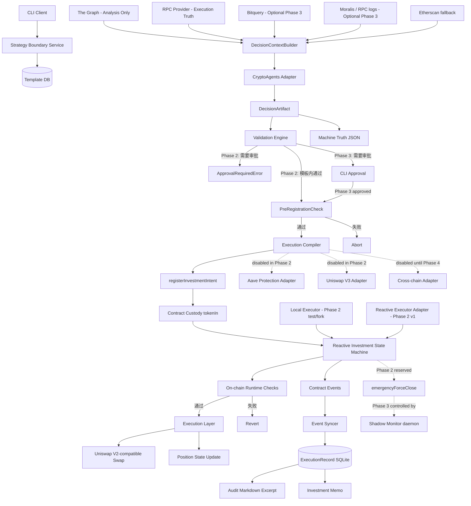
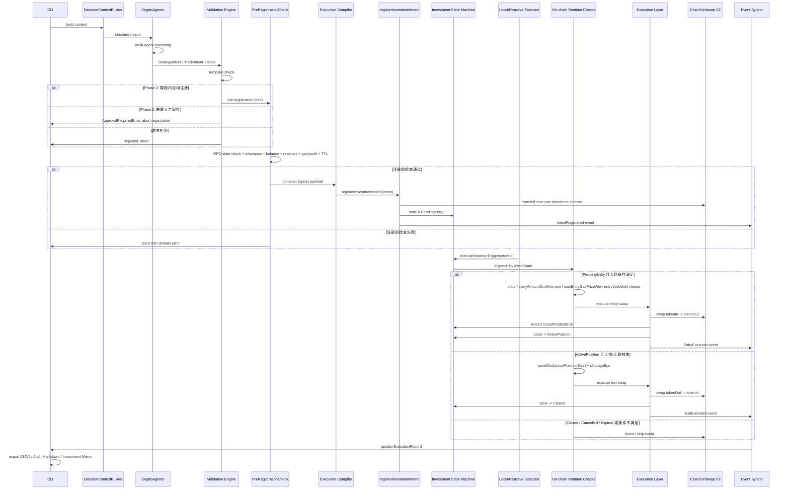

# PRD：基于 CryptoAgents 的单链 DeFi 自动交易系统（CLI 终版 v11｜Phase 2 Core Execution Loop 修订版）


## 1. 产品概述

> v11 修订重点：本版本将 Phase 2 固定为 **Core Execution Loop**，即单链、long-only、Uniswap V2-compatible、注册时资金托管、Reactive/Local executor 触发的链上条件执行闭环。完整 Approval Flow、Shadow Monitor daemon、Aave Protection、Uniswap V3、多链/跨链执行、Webhook 告警等模块不进入 Phase 2 主线，统一采用 **feature flag 默认禁用 + 接口预留 + 后续阶段实现** 的处理方式。

### 1.1 产品目标
构建一个**基于 CryptoAgents 的单链 DeFi 自动交易系统（CLI 形态）**，实现以下闭环：

- 多智能体决策：使用 CryptoAgents 作为决策编排底座。CryptoAgents 明确定位为面向加密货币交易的多智能体 LLM 框架，包含 analyst、research debate、risk management 和 portfolio management 等角色，并提供交互式 CLI。
- 人机协同约束：用户不直接写 JSON，而是通过策略配置流程定义边界，系统内部固化为模板。
- 自动执行：单链 Uniswap V2-compatible 条件执行。
- 自动保护：Reactive stop-loss / take-profit。
- 链上状态机：Reactive Investment Position State Machine（投资仓位状态机）。
- 可审计输出：结构化 JSON + Markdown 摘抄文件。
- 投研输出：Investment Memo / 投资分析报告。
- 未来扩展：为 Approval Flow、Shadow Monitor、Aave Protection、Uniswap V3、Hyperlane 与 gasless-cross-chain-atomic-swap 预留接口，但不让这些能力阻塞 Phase 2 主执行闭环。

### 1.2 产品范围与阶段边界

#### 当前版本的工程边界
本 PRD 当前服务于 Phase 2 开发。Phase 2 的唯一主目标是：

> 从 `TradeIntent` 到链上 `InvestmentIntent` 注册、Reactive/Local 条件触发、入场/出场状态机执行、ExecutionRecord 与导出闭环的最小可用系统。

Phase 2 不追求“全功能 DeFi 自动化平台”，只追求核心执行链路可重复、可测试、可审计。

#### Phase 1：Decision Foundation
Phase 1 只负责决策基础设施，不交付完整链上执行闭环：

- CryptoAgents fork 与 CLI 基础。
- DecisionContextBuilder。
- StrategyTemplate / StrategyIntent / TradeIntent schema。
- Strategy Boundary 基础。
- RPC + The Graph 最小输入通路。
- Machine Truth / Audit Markdown / Investment Memo 基础输出。
- 不实现链上状态机执行闭环。
- 不实现完整 Approval Flow。
- 不实现 Shadow Monitor daemon。
- 不实现 Aave Protection。
- 不实现跨链。

#### Phase 2：Core Execution Loop
Phase 2 固定为单链执行闭环，必须交付：

- Validation Engine v1。
- PreRegistrationCheck v1。
- Execution Compiler v1。
- ReactiveInvestmentCompiler 合约 v1。
- Uniswap V2-compatible entry swap。
- Reactive/Local executor 触发入场。
- PendingEntry -> ActivePosition -> Closed 状态机。
- stop-loss / take-profit 出场。
- ExecutionRecord 持久化。
- Audit Markdown / Investment Memo 导出。
- LocalExecutorAdapter，用于 fork/testnet 调试。
- ReactiveExecutorAdapter v1，用于真实 Reactive callback 适配。

Phase 2 明确约束：

- 仅支持单链。
- 仅支持 long-only。
- 仅支持 Uniswap V2-compatible router。
- 仅支持注册时托管 `tokenIn`。
- 仅支持 `tokenIn -> tokenOut` 入场，`tokenOut -> tokenIn` 出场。
- 价格源使用链上 `IPriceOracleAdapter`。
- `requires_manual_approval == true` 时直接中止，不进入上链注册。
- `crosschain == true` 时直接拒绝。
- `dex == uniswap_v3` 时直接拒绝。
- Aave Protection 默认禁用。
- Shadow Monitor daemon 默认禁用，仅保留合约逃生舱与事件。

#### Phase 3：Control Plane + Operational Safety
Phase 3 只处理“系统已经会交易之后，如何安全运营”：

- 完整 Approval Flow。
- ApprovalBattleCard。
- 审批 TTL。
- 审批后重新 PreRegistrationCheck。
- Shadow Monitor daemon。
- 备用 RPC 对账。
- Grace Period。
- Critical Alert View。
- `execution force-close` 完整 CLI 流程。
- 事件 replay。
- 结构化日志增强。
- Bitquery / Moralis 可选接入。
- stdout + file alerts。
- 可选 webhook alerts。

#### Phase 3.5：Risk & DEX Adapter Expansion
Phase 3.5 是独立增强 Sprint，不阻塞 Phase 3 主线：

- Aave Protection。
- Uniswap V3 Adapter。
- Oracle adapter hardening。
- 更复杂的 route selection。
- 更完整的 gas/profit simulation。

#### Phase 4：Cross-chain / Multi-chain Expansion
Phase 4 才处理跨链和多链执行：

- Hyperlane adapter。
- gasless-cross-chain-atomic-swap adapter。
- multi-chain ExecutionRecord。
- cross-chain state reconciliation。
- bridge security policy。
- cross-chain failure recovery。

#### 明确不做
- Web UI。
- HFT。
- 主动 MEV Extraction。
- RL 策略进化。
- Phase 2 内的多链/跨链执行。
- Phase 2 内的 Uniswap V3。
- Phase 2 内的完整审批队列。
- Phase 2 内的完整 Shadow Monitor daemon。
- Phase 2 内的 Aave Protection。

### 1.3 产品定位（关键升级）
本系统从“AI 自动交易系统”升级为：

> **AI 投研 + 条件执行驱动的链上投资系统**

CryptoAgents 的角色从：
- 交易员（直接下单）

升级为：
- 投资产品经理 / 投研负责人（制定策略、输出 thesis、形成投资备忘录）

### 1.4 核心原则
1. 执行真相唯一来源是结构化 JSON。
2. Markdown 审计副本只做摘抄，不做总结生成。
3. Investment Memo 允许基于结构化结果和推理过程生成分析报告。
4. 执行层只信 RPC，不信第三方索引 API。
5. AI 不直接控制资金，不直接生成最终 calldata，不直接签名。
6. 所有交易必须先经过策略模板与注册前二次确认。
7. 所有执行为条件触发（非即时市价执行）。
8. Reactive 负责事件驱动、条件触发和 callback，不负责自由决策。
9. 系统必须内建 **MEV Protection**，当前路线不做 **MEV Extraction**。
10. 三轨输出并存：Machine Truth / Audit Markdown / Investment Memo。
11. 执行编译器工作于**注册时**，不是触发时。
12. 安全检查必须拆分为：**链下注册前检查** + **链上运行时硬约束**。
13. 智能合约架构采用 **Investment Position State Machine**，不采用“链上只发信号、链下再执行”的混合模式。
14. Phase 2 合约必须预留 `emergencyForceClose` 逃生舱；完整 Shadow Monitor daemon 移至 Phase 3。
15. Phase 2 的 `requires_manual_approval` 不进入审批队列，而是直接中止注册；完整 Approval Flow 移至 Phase 3。
16. Phase 2 必须使用 feature flag 显式禁用未实现模块，禁止半实现能力误接入主链路。
17. 工程实现遵循 **Library-First、Lean Defensive Coding、TODO Strategy**。
18. 阶段边界必须优先于功能诱惑：凡会改变资金模型、执行域或状态机维度的能力，必须延后到独立阶段。


## 2. 参考仓库与许可

### 2.1 参考仓库
- CryptoAgents：多智能体加密交易框架，Apache-2.0，且 README 明确说明其是对 TradingAgents 的重度编辑 fork。仓库地址：<https://github.com/sserrano44/CryptoAgents>
- TradingAgents：多智能体金融交易框架，Apache-2.0。仓库地址：<https://github.com/TauricResearch/TradingAgents>
- Reactive smart contract demos：用于 CRON、Uniswap stop-loss/take-profit、Aave protection、Approval Magic、Hyperlane 等模式参考。仓库地址：<https://github.com/Reactive-Network/reactive-smart-contract-demos>

### 2.2 许可要求
- CryptoAgents：Apache-2.0。
- TradingAgents：Apache-2.0。
- Reactive demos：在实际复用代码前，需在实现阶段再次核验仓库 LICENSE 文件并保留原版权与引用说明。当前 PRD 只将其作为模式参考和适配来源。

### 2.3 外部设计依据（v11 补充）
本 PRD 对 Phase 2 边界的收敛基于以下工程事实：

1. **Reactive Network demos** 已覆盖 Uniswap V2 stop-loss / take-profit、CRON、Aave protection、Approval Magic、Hyperlane 等不同自动化模式。本系统不应在 Phase 2 一次性吞下所有模式，而应先复用 Uniswap V2 price-triggered automation 的形态跑通单链状态机。
2. **Uniswap V3** 的单池 swap 引入 fee tier、`sqrtPriceLimitX96`、refund 未使用 token 等额外语义；Phase 2 同时支持 V2 与 V3 会显著扩大编译器、滑点、测试矩阵和资金处理复杂度。
3. **Aave Protection** 以 health factor、collateral value、debt value、liquidation threshold 为核心，属于独立借贷风险模型，不应阻塞 spot 条件执行闭环。
4. **Hyperlane Warp Routes** 属于跨链资产桥接/消息系统，每条 Route 可以有不同安全配置和信任假设；跨链执行会改变资金域、失败恢复和 ExecutionRecord 结构，因此不进入 Phase 2 或 Phase 3 主线。


## 3. 总体架构

### 3.1 Module Relationship Diagram



### 3.2 架构说明
- `Validation -> Execution` 不再直接串联，而是改为：`Validation -> PreRegistrationCheck -> Execution Compiler -> registerInvestmentIntent -> Investment State Machine -> On-chain Runtime Checks -> Execution`。
- Decision 层与 Execution 层通过 `StrategyIntent`、`TradeIntent`、`ExecutionPlan` 解耦。
- Phase 2 中，`ValidationResult.requires_manual_approval == true` 不进入审批队列，而是立即返回 `ApprovalRequiredError`；Phase 3 再接完整审批流。
- Phase 2 中，合约在注册时托管 `tokenIn`，确保 Reactive callback 触发时不依赖用户余额或 allowance 的实时状态。
- Phase 2 中，执行域固定为单链、long-only、Uniswap V2-compatible，避免同时引入 V3、Aave 和跨链导致状态机膨胀。
- 输入层采用“多源 API + 轻量特征层 + 统一 ContextBuilder”，但执行真相仍以 RPC 与链上事件为准。
- 输出层严格拆为：
  - Machine Truth：执行真相。
  - Audit Markdown：摘抄审计副本。
  - Investment Memo：面向用户/投委会的投研报告。
- Execution Compiler 是桥接层，负责在**注册时**根据 `TradeIntent`、模板约束、token decimals 和链上价格口径生成 `InvestmentIntent` 注册载荷。
- Reactive 合约维护 `PendingEntry -> ActivePosition -> Closed / Cancelled / Expired` 的投资仓位状态机。
- 运行时安全边界不依赖链下参与，而是由状态机合约中的 `require` 与状态枚举强制执行。


## 4. 核心数据流

### 4.1 Critical Sequence Diagram（Phase 2 默认路径）



### 4.2 Phase 3 审批回流规则
Phase 3 接入完整 Approval Flow 后，人工批准不得直接注册上链。审批通过后必须重新执行：

```text
approval approve
→ reload TradeIntent
→ TTL check
→ Validation Engine re-check
→ PreRegistrationCheck re-run
→ Execution Compiler re-run
→ registerInvestmentIntent
```

原因：审批等待期间链上价格、储备、gas、余额、allowance 都可能已经变化，不能复用旧的注册前检查结果。

## 5. 功能拆分

### 5.1 决策层：CryptoAgents Adapter
职责：
- 调用 CryptoAgents 多角色流程
- 保留 analyst / research / risk / portfolio 的多智能体推理骨架
- 输出结构化 `DecisionArtifact`
- 输出长期投资 thesis 和 Investment Memo
- 不直接输出最终可执行 calldata

不再负责：
- 即时交易
- 直接下单
- 直接编码合约参数

#### 5.1.1 可 100% 迁移的核心资产（直接复用）
基于 CryptoAgents（以及其上游 TradingAgents）的现有实现，下列能力可直接迁移，不需要重写底盘：

1. **多角色辩论机制（Research Debate Framework）**
   - 保留 Analyst / Risk Manager / Portfolio Manager 等多角色协作与审阅流转机制。
   - 这套多 Agent 协作框架与当前 PRD 中“投研出报告、风控卡预算、组合经理形成最终条件意图”的逻辑天然一致。

2. **投资组合状态注入（Portfolio State Injection）**
   - 原框架已具备将 Cash / Holdings / 历史盈亏注入 Agent 上下文的能力。
   - 在本项目中直接映射到 `DecisionContext.position_state`。

3. **Agent 原始推理痕迹捕获（Agent Trace）**
   - 原框架对各 Agent 的中间输出、推理痕迹和对话流已有较成熟的组织方式。
   - 本项目直接复用，用于：
     - `AgentTrace`
     - `Audit Markdown`
     - `Investment Memo` 的论据素材

#### 5.1.2 借壳改造路径（推荐实施策略）
本项目不从零手写大模型编排层，而是采用：

> **Fork CryptoAgents，保留编排底盘，替换传感器（输入数据）和方向盘（输出目标）**

具体实施：
- 保留其多 Agent 聊天 / 辩论 / 角色流转循环；
- 保留其 CLI 交互骨架；
- 替换其 `data_fetcher` / 数据接入层；
- 重写最终 `Portfolio Manager` Prompt，使其从“Buy/Sell/Hold 自由文本”切换为“条件意图 JSON + thesis”。

#### 5.1.3 Prompt 框架重构（重度魔改）
原版 Prompt 更偏“现在买 / 现在卖 / 现在观望”的短线交易员范式。  
本项目中必须将最终决策 Prompt 改写为：

- 不输出 Market Order 自由文本
- 不输出即时执行建议
- 强制输出 **Conditional Intent**
- 强制输出 **Structured Output JSON**

新的 Prompt 约束要点：
- 必须给出合理的 `trigger_price_max` / `trigger_price_min`
- 必须给出 `valid_until_sec`
- 必须给出 `max_slippage_bps`
- 必须给出 `stop_loss_bps` / `take_profit_bps`
- 必须输出 `investment_thesis`

推荐让 Portfolio Manager 输出一个“组合对象”，而不是把所有信息直接塞进执行 JSON：

```json
{
  "trade_intent": {
    "pair": "WETH/USDC",
    "side": "buy",
    "size_pct_nav": 0.05,
    "entry_conditions": {
      "trigger_price_max": 3000.0,
      "valid_until_sec": 86400
    },
    "max_slippage_bps": 50,
    "stop_loss_bps": 300,
    "take_profit_bps": 1000
  },
  "investment_thesis": "ETH 跌破关键位后可能出现流动性错杀与清算级黄金坑，因此采用条件挂单而非追涨。"
}
```

说明：
- `trade_intent` 进入执行链路；
- `investment_thesis` 进入 `DecisionMeta` / `Investment Memo`；
- 执行层仍然只读取结构化执行字段，不读取自由文本。
- 结构化输出必须以 **Pydantic v2 模型** 为单一真相源；若所选模型提供原生 Structured Outputs，则优先使用原生能力；否则使用 `Instructor` 进行约束输出。

### 5.2 输入层：DecisionContextBuilder
职责：
- 从多数据源取数
- 做轻量特征工程
- 统一上下文结构
- 屏蔽底层 provider 差异

新增原则：
- 输入数据从“tick 级交易噪声”转向“趋势级、条件级、资金流级”信号
- 以小时线 / 日线、资金流趋势、链上行为模式为主
- 避免把短时间状态漂移极大的微观数据直接交给慢推理链路

#### 5.2.1 输入视角改造：从短线交易员到机构级长线投研
原版 CryptoAgents 的默认输入倾向更接近高频/短线交易员，例如：
- 高频 OHLCV
- 短周期 RSI
- 订单簿深度
- 1m/5m 微观价格波动

本项目需要把输入视角上移到更适合长期条件投资的层次。

**原版输入倾向示例**
```json
{
  "current_price": 3050.5,
  "1m_candles": [],
  "order_book_depth": {"bids": [], "asks": []},
  "rsi_15m": 65
}
```

**本项目适配后的输入框架**
```json
{
  "macro_market": {
    "current_price": 3050.5,
    "daily_ma_50": 3100,
    "daily_ma_200": 2800,
    "implied_volatility_7d": 0.45
  },
  "onchain_flow": {
    "dex_volume_24h_trend": "increasing",
    "large_transfers_inflow_net": "+5000 ETH",
    "tvl_change_7d_pct": 2.5
  },
  "risk_environment": {
    "aave_borrow_rate_weth": 0.035,
    "network_base_fee_gwei": 15
  },
  "portfolio_state": {
    "nav_usdt": 100000,
    "current_exposure_pct": 0.2
  }
}
```

结论：
- 减少 tick 级与订单簿级噪声依赖；
- 增强趋势、资金流、风险环境、组合状态输入；
- 更符合“投研大脑 + 条件执行肌肉”的系统定位。

### 5.3 约束层：Strategy Boundary Service
职责：
- 创建/修改/查看策略模板
- 模板版本管理
- 约束边界校验
- 决定自动注册、人工审批或拒绝


### 5.4 校验层：Validation Engine
职责：
- 校验 `StrategyIntent` / `TradeIntent` 是否在模板范围内。
- 输出 `ValidationResult`。
- 不执行链上状态确认。
- 在 Phase 2 中明确区分 `PASSED`、`REJECTED`、`REQUIRES_MANUAL_APPROVAL`。

强制约束：
- **禁止手写字典字段检查和散落的 `if a > b` 校验逻辑**。
- 所有校验必须基于 **Pydantic v2** 模型完成，使用：
  - 字段类型约束；
  - `field_validator` / `model_validator`；
  - `ValidationError`；
  - 领域异常。
- `StrategyTemplate`、`StrategyIntent`、`TradeIntent`、`ExecutionPlan`、`ApprovalBattleCard` 等核心对象必须全部映射为 Pydantic Models。

Phase 2 强制分流：

```text
ValidationResult.status == PASSED
→ 进入 PreRegistrationCheck

ValidationResult.status == REQUIRES_MANUAL_APPROVAL
→ 抛出 ApprovalRequiredError
→ 不创建审批队列
→ 不注册上链

ValidationResult.status == REJECTED
→ 直接拒绝
```

Phase 2 核心校验：
- `pair in template.allowed_pairs`
- `dex == uniswap_v2`
- `side == buy`
- `crosschain == false`
- `chain_id == template.chain_id`
- `size_pct_nav <= template.max_position_pct_nav`
- `max_slippage_bps <= template.max_slippage_bps`
- `stop_loss_bps` 在模板范围内
- `take_profit_bps` 在模板范围内
- `time_in_force_sec` 合理
- `entry_conditions.valid_until_sec` 未过期

不允许：
- 在业务层重复发明 schema 校验逻辑；
- 在多个模块中各自维护一套“边界比较 if/else”；
- 在 Phase 2 中把需要审批的 intent 半自动推进到注册链路。

### 5.5 注册前安全层：PreRegistrationCheck
职责：
- 用 RPC 做注册前状态确认。
- 重新确认储备、基准滑点、余额、allowance、基准 gas、TTL 等。
- 计算盈亏平衡点（Break-even）。
- 校验 Gas 成本占比（Gas / Expected Profit）。
- 决定是否允许注册 Reactive 条件单。

Phase 2 PreRegistrationCheck 只处理 spot long-only 条件单，不处理 Aave health factor。Aave 相关检查保留 adapter skeleton，默认禁用。

必须检查：

```text
wallet tokenIn balance >= amountIn
allowance >= amountIn
entryValidUntil > now
pair reserves readable
estimated slippage <= max_slippage_bps
base gas price <= template.max_entry_gas_price_gwei
estimated gas_to_profit_ratio <= template.max_gas_to_profit_ratio
```

收益 / Gas 公式：

```text
estimated_total_gas_cost_usd =
    register_gas_usd
  + expected_entry_callback_gas_usd
  + expected_exit_callback_gas_usd

gross_take_profit_usd =
    amount_in_usd * take_profit_bps / 10_000

gas_to_profit_ratio =
    estimated_total_gas_cost_usd / gross_take_profit_usd

if gas_to_profit_ratio > template.max_gas_to_profit_ratio:
    reject
```

建议领域异常：

```text
InsufficientBalanceError
InsufficientAllowanceError
ExpiredIntentError
GasTooHighError
GasToProfitTooHighError
SlippageTooHighError
UnsupportedPairError
UnsupportedDexError
UnsupportedCrosschainError
ApprovalRequiredError
```

说明：
- 这里校验**注册时**可行性，不承担运行时最终防守职责。
- 运行时仍由合约执行价格、滑点、状态、TTL、gas 等硬约束。
- 核心业务函数内禁止局部 `try/except` 吞异常，失败应快速抛出领域异常，由 CLI 主循环或全局错误边界统一渲染。

### 5.6 Execution Compiler
职责：
- 将 `StrategyIntent` / `TradeIntent` 编译为 `ExecutionPlan`。
- 在**注册时**基于模板、token decimals、价格口径、slippage、TTL 生成 `InvestmentIntent` 注册载荷。
- 预先写死以下**入场阶段**链上硬约束参数：
  - `entryTriggerPrice`；
  - `entryAmountOutMinimum`；
  - `entryValidUntil`；
  - `maxEntryGasPriceWei`。
- 预先写死以下**出场阶段**相对约束参数：
  - `stopLossPrice`；
  - `stopLossSlippageBps`；
  - `takeProfitPrice`；
  - `takeProfitSlippageBps`。
- 将意图层与执行层隔离。
- 将单笔条件单升级为“投资仓位状态机”的完整注册载荷。

关键计算原则：

```text
amountIn = NAV * size_pct_nav
entryTriggerPrice = entry_conditions.trigger_price_max
entryAmountOutMinimum = expectedOutAtTrigger * (10_000 - max_slippage_bps) / 10_000
stopLossPrice = entryTriggerPrice * (10_000 - stop_loss_bps) / 10_000
takeProfitPrice = entryTriggerPrice * (10_000 + take_profit_bps) / 10_000
entryValidUntil = now + time_in_force_sec
maxEntryGasPriceWei = template.max_entry_gas_price_gwei * 1e9
```

`entryAmountOutMinimum` 不应仅基于注册瞬间 spot price 计算，而应以 trigger price、amountIn、token decimals、max slippage bps 为基准。注册瞬间 spot price 只作为合理性校验输入，不作为唯一执行死线。

说明：
- calldata 不由 AI 生成。
- 不在触发时执行编译，避免把链下延迟重新引入触发链路。
- 编译器在注册时只对**入场**相关绝对约束做一次性计算。
- 对于止损/止盈，编译器不在入场前预计算绝对 `amountOutMinimum`，而是把**滑点容忍比例（BPS）**上链。
- 合约在入场成功时记录真实买入数量 `actualPositionSize`，并在未来出场触发时，基于 `actualPositionSize + 当前 quote + slippageBps` 动态计算最小可接受输出。
- 编译器必须重点测试 USDC 6 decimals 与 WETH 18 decimals 的换算。

### 5.7 执行层：Execution Layer（重构）
职责：
- 不再在校验通过后立即 swap
- 只在 Reactive 条件触发并通过链上运行时检查后执行
- 负责实际链上调用和回执落库


### 5.8 Reactive 层（Phase 2 收敛版）
职责：
- 入场（Limit / Conditional Entry）。
- 出场（StopLoss / TakeProfit）。
- 触发 `executeReactiveTrigger(intentId)`。
- 不做自由决策。
- 不在 callback 中重新编译执行计划。

Phase 2 executor 分层：

```text
LocalExecutorAdapter
- 本地 fork / testnet / CI 调试用
- 模拟 Reactive callback
- 用于先跑通状态机与事件同步

ReactiveExecutorAdapter
- 真实 Reactive callback 适配
- 只负责触发 executeReactiveTrigger
- 不做决策、不做注册前检查、不做参数重算
```

Phase 2 不做：
- Approval Magic 完整流程。
- Aave Protection。
- Hyperlane。
- gasless cross-chain atomic swap。
- Uniswap V3 adapter。

### 5.9 Investment Position State Machine Contract（Phase 2 核心合约）
职责：
- 把单笔条件单升级为“投资仓位状态机”。
- 在同一个 Intent 中同时维护：
  - owner / recipient；
  - tokenIn / tokenOut；
  - amountIn；
  - 入场触发条件；
  - 入场滑点死线；
  - 入场 TTL；
  - 入场阶段 Gas 死线；
  - 止损参数；
  - 止盈参数；
  - 实际持仓量；
  - 实际退出数量；
  - 当前状态；
  - close reason；
  - proceeds withdrawal 状态。

#### 5.9.1 资金模型：注册时托管 tokenIn
Phase 2 采用**注册时托管资金**，而不是触发时从用户钱包拉取资金。

注册时逻辑：

```solidity
require(intent.amountIn > 0, "amountIn=0");
IERC20(intent.tokenIn).safeTransferFrom(msg.sender, address(this), intent.amountIn);
intents[intentId] = intent;
intents[intentId].owner = msg.sender;
intents[intentId].state = IntentState.PendingEntry;
```

选择理由：
- 触发时一定有资金可执行。
- 不依赖用户之后是否撤销 allowance。
- 不依赖用户之后是否转走余额。
- `PendingEntry -> ActivePosition -> Closed` 的状态机可以自洽管理资产生命周期。
- 更符合“纯链上条件执行闭环”。

必须配套：

```solidity
function cancelExpiredIntent(uint256 intentId) external;
function withdrawClosedProceeds(uint256 intentId) external;
```

#### 5.9.2 合约接口契约

```solidity
// SPDX-License-Identifier: MIT
pragma solidity ^0.8.20;

interface IReactiveInvestmentCompiler {
    enum IntentState {
        PendingEntry,
        ActivePosition,
        Closed,
        Cancelled,
        Expired
    }

    enum CloseReason {
        None,
        TakeProfit,
        StopLoss,
        EmergencyForceClose,
        Cancelled,
        Expired
    }

    struct InvestmentIntent {
        address owner;
        address recipient;

        address tokenIn;
        address tokenOut;
        uint256 amountIn;

        address router;
        address pair;
        address priceOracle;

        uint256 entryTriggerPriceE18;
        uint256 entryAmountOutMinimum;
        uint256 entryValidUntil;
        uint256 maxEntryGasPriceWei;

        uint256 stopLossPriceE18;
        uint256 stopLossSlippageBps;
        uint256 takeProfitPriceE18;
        uint256 takeProfitSlippageBps;

        uint256 actualPositionSize;
        uint256 actualExitAmount;

        uint256 createdAt;
        uint256 entryExecutedAt;
        uint256 closedAt;

        IntentState state;
        CloseReason closeReason;
        bool proceedsWithdrawn;
    }

    function registerInvestmentIntent(InvestmentIntent calldata intent)
        external
        returns (uint256 intentId);

    function executeReactiveTrigger(uint256 intentId) external;

    function cancelExpiredIntent(uint256 intentId) external;

    function withdrawClosedProceeds(uint256 intentId) external;

    function emergencyForceClose(uint256 intentId, uint256 maxSlippageBps) external;
}
```

说明：
- `maxGasPriceGwei` 废弃，链上字段统一使用 `maxEntryGasPriceWei`。
- 价格字段统一使用 `E18` 定点数。
- `owner` 是资金和 intent 所有者。
- `recipient` 是收益接收地址，默认等于 owner。
- Phase 2 只支持 Uniswap V2-compatible router，因此不包含 Uniswap V3 fee tier。
- 若未来接入 V3，必须通过新的 adapter 和 struct extension，不允许在 Phase 2 合约中半实现。

#### 5.9.3 状态机流转
- 初始状态：`PendingEntry`。
- 第一次触发：若入场条件满足，则执行入场，状态流转到 `ActivePosition`。
- 入场成功后，合约记录 `actualPositionSize`。
- 第二次触发：若止损或止盈条件满足，则基于 `actualPositionSize` 计算出场最小可接受输出并执行出场，状态流转到 `Closed`。
- `Closed` 状态下不得再次触发执行。
- `Cancelled` 与 `Expired` 是终态，禁止再次触发执行。

#### 5.9.4 链上运行时硬防守
运行时检查必须按状态机分作用域，不能无差别施加到所有状态。

**PendingEntry（入场阶段）检查：**

```solidity
require(intent.state == IntentState.PendingEntry, "invalid state");
require(block.timestamp <= intent.entryValidUntil, "Entry TTL expired");
require(tx.gasprice <= intent.maxEntryGasPriceWei, "Gas fee too high at entry");
require(currentPriceE18 <= intent.entryTriggerPriceE18, "entry condition not met");
require(quoteOut >= intent.entryAmountOutMinimum, "Slippage exceeded/MEV attacked");
```

**ActivePosition（出场阶段）检查：**

```solidity
require(intent.state == IntentState.ActivePosition, "invalid state");
require(
    currentPriceE18 <= intent.stopLossPriceE18 ||
    currentPriceE18 >= intent.takeProfitPriceE18,
    "exit condition not met"
);

uint256 slippageBps = isStopLoss ? intent.stopLossSlippageBps : intent.takeProfitSlippageBps;
uint256 exitAmountOutMinimum = quoteOut(intent.actualPositionSize) * (10_000 - slippageBps) / 10_000;
require(amountOut >= exitAmountOutMinimum, "Exit slippage exceeded");
```

说明：
- `entryValidUntil` 和 `maxEntryGasPriceWei` 只约束入场。
- 一旦进入 `ActivePosition`，止损/止盈是逃生或落袋动作，不能再被入场阶段 TTL 或 gas 预算拦截。
- 出场阶段仍受滑点保护。

#### 5.9.5 Price Oracle Adapter
Phase 2 必须显式定义价格接口，不能把 trigger price 与 swap quote 混为一谈。

```solidity
interface IPriceOracleAdapter {
    function getPrice(address tokenBase, address tokenQuote) external view returns (uint256 priceE18);
    function quoteOut(address tokenIn, address tokenOut, uint256 amountIn) external view returns (uint256 amountOut);
}
```

Phase 2 最小实现：

```text
UniswapV2PriceOracleAdapter
- getPrice(): based on pair reserves
- quoteOut(): based on Uniswap V2 getAmountOut formula
```

口径区分：
- `trigger price`：用于判断是否触发入场 / 止损 / 止盈。
- `swap quote`：用于计算 `amountOutMinimum` 与执行前滑点边界。

#### 5.9.6 Callback 授权、幂等与重放保护
Phase 2 必须定义谁能调用 `executeReactiveTrigger`。

建议：

```solidity
modifier onlyAuthorizedExecutor() {
    require(
        msg.sender == reactiveCallbackSender || authorizedExecutors[msg.sender],
        "not authorized executor"
    );
    _;
}
```

核心要求：
- `executeReactiveTrigger` 必须 `nonReentrant`。
- `registerInvestmentIntent` 必须 `nonReentrant`。
- `Closed / Cancelled / Expired` 状态重复触发必须 revert。
- 同一 intent 的 entry 只能成功一次。
- 同一 intent 的 exit 只能成功一次。
- force-close 成功后，迟滞到达的正常 Reactive callback 必须 revert。

#### 5.9.7 事件定义
Phase 2 必须定义事件，因为 ExecutionRecord、Audit Markdown、Shadow Monitor 和后续 replay 都依赖这些事件。

```solidity
event IntentRegistered(uint256 indexed intentId, address indexed owner);
event EntryExecuted(uint256 indexed intentId, uint256 amountIn, uint256 amountOut);
event ExitExecuted(uint256 indexed intentId, uint256 positionSize, uint256 amountOut, CloseReason reason);
event IntentExpired(uint256 indexed intentId);
event IntentCancelled(uint256 indexed intentId);
event EmergencyForceClosed(uint256 indexed intentId, uint256 amountOut);
event TriggerSkipped(uint256 indexed intentId, string reason);
event ProceedsWithdrawn(uint256 indexed intentId, address indexed recipient, uint256 amountOut);
```

#### 5.9.8 Emergency Force Close（Phase 2 预留，Phase 3 完整接入）
当 Shadow Monitor 发现“该死却没死”的异常状态，并且超过 Grace Period 后，系统必须允许管理员通过 CLI 调用链上逃生舱。

Phase 2 合约必须实现接口和 Foundry 测试：

```solidity
function emergencyForceClose(uint256 intentId, uint256 maxSlippageBps) external onlyAuthorizedEmergencyOperator nonReentrant;
```

Phase 2 不实现完整 Shadow Monitor daemon，但必须保证：
- 仅在 `IntentState == ActivePosition` 时允许调用。
- 调用前先把状态写为 `Closed` 或在重入安全边界内确保不可重复平仓。
- 紧急卖出允许较宽滑点，以“逃命优先”为原则。
- emit `EmergencyForceClosed`。
- 后续迟滞 callback 因状态不是 `ActivePosition` 而 revert。

### 5.10 导出层：Export / Markdown Excerpt
职责：
- 导出 JSON
- 导出 Audit Markdown 摘抄
- 导出 Investment Memo
- Audit 不做自由文本改写

### 5.11 CLI 层
职责：
- 策略管理
- 决策运行
- 审批
- 执行查询
- 导出记录
- 高危告警与强制人工动作（如手动平仓）


### 5.12 Shadow Monitor（Phase 3 主实现，Phase 2 仅预留）
职责：
- 监控 Reactive Trigger 是否迟滞。
- 监控 stop-loss / take-profit 是否已被击穿但 callback 未执行。
- 向 CLI 发出高危警报。
- 指导人工或授权 relayer 执行 emergency force-close。

Phase 2 处理方式：
- 不实现完整 daemon。
- 合约保留 `emergencyForceClose`。
- 合约保留 `CloseReason.EmergencyForceClose`。
- 合约保留 `EmergencyForceClosed` event。
- ExecutionRecord 保留 `close_reason` 字段。
- CLI 可保留 `execution force-close` stub，但默认隐藏或标注 experimental。

Phase 3 再实现：
- `shadow_monitor.py` daemon。
- 备用 RPC 对账。
- Grace Period 计时。
- Critical Alert View。
- `agent-cli monitor alerts`。
- `agent-cli execution force-close <intent-id>` 完整流程。
- stdout + file log alerts。
- 可选 Telegram / Discord / 钉钉 Webhook。

#### 5.12.1 非对称监听机制（Phase 3）
Shadow Monitor 每隔 N 个区块轮询一次状态为 `ActivePosition` 的意图，并向备用 RPC 发起两类查询：
1. 当前预言机 / 池子价格是否已击穿止损线或突破止盈线；
2. 合约内该 Intent 的状态是否仍为 `ActivePosition`。

若价格条件已满足，但合约状态在多个区块后仍未变化，则视为 Reactive 回调迟滞。

#### 5.12.2 Grace Period（Phase 3）
为避免与正常回调并发冲突，Monitor 不应在价格刚击穿的瞬间立刻报警。

规则：
- 默认给予一个容忍缓冲，例如 **3 个区块或 1 分钟**。
- 若在 Grace Period 结束后，Intent 状态仍未变更，则升级为最高级别警报。

#### 5.12.3 高危报警与人工接管（Phase 3）
达到最高级别警报后：
- CLI 必须醒目渲染高危警报。
- 当前阶段先做 **Stdout 打印 + 日志落盘**。
- Webhook 异步通知模块为 Phase 3 可选项。
- CLI 应支持 `agent-cli execution force-close <intent-id>`。
- 警报信息必须说明：
  - 当前状态；
  - 价格已击穿/突破的情况；
  - 额外损失估算；
  - 建议的紧急动作。

## 6. Core Abstractions and Primary Data Structures

### 6.1 DecisionContext
统一决策输入。

```json
{
  "market": {},
  "liquidity": {},
  "onchain_flow": {},
  "risk_state": {},
  "position_state": {},
  "strategy_constraints": {},
  "execution_state": {
    "reserve_snapshot": "",
    "expected_slippage": "",
    "gas_estimate": "",
    "health_factor": ""
  }
}
```

说明：
- `execution_state` 由 RPC 提供，仅用于辅助 agent 判断与注册前检查，不能替代最终链上确认。


### 6.2 StrategyTemplate
策略模板，内部真相对象。

```json
{
  "template_id": "tpl_001",
  "name": "eth-breakout-v1",
  "chain_id": 1,
  "allowed_pairs": ["WETH/USDC"],
  "allowed_dex": ["uniswap_v2"],
  "allowed_routers": ["0x..."],
  "allowed_price_oracles": ["0x..."],
  "max_position_pct_nav": 0.05,
  "max_slippage_bps": 80,
  "stop_loss_min_bps": 200,
  "stop_loss_max_bps": 500,
  "take_profit_min_bps": 400,
  "take_profit_max_bps": 1200,
  "max_daily_trades": 3,
  "max_daily_loss_pct_nav": 0.03,
  "max_gas_to_profit_ratio": 0.15,
  "min_expected_profit_usd": 20,
  "max_entry_gas_price_gwei": 25,
  "execution_mode": "auto",
  "manual_review_if_out_of_bounds": true,
  "status": "active",
  "version": 1
}
```

Phase 2 约束：
- `allowed_dex` 只能包含 `uniswap_v2`。
- `manual_review_if_out_of_bounds == true` 只表示“未来可审批”，Phase 2 中仍返回 `ApprovalRequiredError`。
- `max_entry_gas_price_gwei` 只作用于入场阶段。
- `max_gas_to_profit_ratio` 用于 PreRegistrationCheck。

### 6.3 StrategyIntent（新增）
长期投资目标的上层抽象。

```json
{
  "strategy_id": "strat_001",
  "asset": "WETH",
  "allocation_target_pct": 0.15,
  "accumulation_window_days": 14,
  "entry_style": "laddered",
  "risk_budget_pct": 0.03,
  "exit_conditions": {
    "hard_stop_loss_bps": 1200
  }
}
```

说明：
- `StrategyIntent` 描述长期目标和风险预算
- 一个 `StrategyIntent` 可拆解为多个 `TradeIntent`


### 6.4 TradeIntent
执行真相的主对象（升级为“条件意图”）。

```json
{
  "intent_id": "intent_002",
  "pair": "WETH/USDC",
  "base_asset": "WETH",
  "quote_asset": "USDC",
  "side": "buy",
  "dex": "uniswap_v2",
  "size_pct_nav": 0.05,
  "entry_conditions": {
    "trigger_price_max": 3050,
    "trigger_price_min": null,
    "valid_until_sec": 1711756800
  },
  "max_slippage_bps": 80,
  "stop_loss_bps": 300,
  "take_profit_bps": 800,
  "time_in_force_sec": 21600,
  "chain_id": 1,
  "target_chain_id": null,
  "crosschain": false
}
```

关键变化：
- 从即时市价单升级为条件单。
- 增加 `entry_conditions`。
- 增加 TTL。
- 强制包含 `max_slippage_bps`。
- Phase 2 仅支持 `side == buy`。
- Phase 2 仅支持 `dex == uniswap_v2`。
- Phase 2 仅支持 `crosschain == false`。

### 6.5 ExecutionPlan
执行计划对象。

```json
{
  "execution_plan_id": "plan_001",
  "intent_id": "intent_002",
  "execution_style": "investment_position_state_machine",
  "compiled_at_registration": true,
  "chain_id": 1,
  "dex": "uniswap_v2",
  "funding_model": "custody_at_registration",
  "register_payload": {
    "owner": "0xOwner",
    "recipient": "0xOwner",
    "tokenIn": "0xUSDC",
    "tokenOut": "0xWETH",
    "amountIn": "5000000000",
    "router": "0xRouter",
    "pair": "0xPair",
    "priceOracle": "0xOracle",
    "entryTriggerPriceE18": "3050000000000000000000",
    "entryAmountOutMinimum": "1613000000000000000",
    "entryValidUntil": 1711756800,
    "maxEntryGasPriceWei": "25000000000",
    "stopLossPriceE18": "2958500000000000000000",
    "stopLossSlippageBps": 80,
    "takeProfitPriceE18": "3294000000000000000000",
    "takeProfitSlippageBps": 80
  }
}
```

说明：
- 由 Execution Compiler 在注册时生成。
- 不是在触发时再编译。
- 是“执行计划”，不是最终交易结果。
- 其本质是对 `InvestmentIntent` 合约载荷的链下编译结果。
- 止损/止盈阶段不在注册时预计算绝对 `amountOutMinimum`，而是预先写入相对滑点容忍度，等待合约在出场触发时结合 `actualPositionSize` 动态计算。
- `maxEntryGasPriceWei` 使用 wei，不使用 Gwei。

### 6.5.1 InvestmentIntent（链上状态机结构）
链上注册载荷对象，对应 `IReactiveInvestmentCompiler.InvestmentIntent`。

```solidity
enum IntentState {
    PendingEntry,
    ActivePosition,
    Closed,
    Cancelled,
    Expired
}

enum CloseReason {
    None,
    TakeProfit,
    StopLoss,
    EmergencyForceClose,
    Cancelled,
    Expired
}

struct InvestmentIntent {
    address owner;
    address recipient;
    address tokenIn;
    address tokenOut;
    uint256 amountIn;
    address router;
    address pair;
    address priceOracle;
    uint256 entryTriggerPriceE18;
    uint256 entryAmountOutMinimum;
    uint256 entryValidUntil;
    uint256 maxEntryGasPriceWei;
    uint256 stopLossPriceE18;
    uint256 stopLossSlippageBps;
    uint256 takeProfitPriceE18;
    uint256 takeProfitSlippageBps;
    uint256 actualPositionSize;
    uint256 actualExitAmount;
    uint256 createdAt;
    uint256 entryExecutedAt;
    uint256 closedAt;
    IntentState state;
    CloseReason closeReason;
    bool proceedsWithdrawn;
}
```

说明：
- `PendingEntry`：尚未入场，合约已托管 tokenIn。
- `ActivePosition`：已入场，合约持有 tokenOut，等待止损/止盈触发。
- `Closed`：仓位已平，禁止再次触发。
- `Cancelled`：未入场前取消并退款。
- `Expired`：未入场前 TTL 过期，可退款。
- `actualPositionSize` 在入场成功后由合约记录，用作未来出场的本金基数。
- `actualExitAmount` 在出场成功后由合约记录。
- `proceedsWithdrawn` 防止重复提现。

### 6.6 DecisionMeta
附加元信息。

```json
{
  "confidence": 0.74,
  "risk_mode": "moderate",
  "thesis": "bullish breakout with rising liquidity"
}
```

### 6.7 AgentTrace
原始推理痕迹，只读，不再加工。

```json
{
  "agents": [
    {"name": "Market Agent", "excerpt": "bullish breakout detected"},
    {"name": "Liquidity Agent", "excerpt": "liquidity rising in last 30m"}
  ]
}
```


### 6.8 ValidationResult
模板校验结果。

```json
{
  "status": "passed",
  "requires_manual_approval": false,
  "violations": [],
  "phase2_action": "continue_to_pre_registration"
}
```

允许值：

```text
PASSED
REJECTED
REQUIRES_MANUAL_APPROVAL
```

Phase 2 行为：

```text
PASSED -> continue_to_pre_registration
REJECTED -> abort
REQUIRES_MANUAL_APPROVAL -> raise ApprovalRequiredError
```

### 6.9 ExecutionRecord
执行结果真相。

```json
{
  "intent_id": "intent_002",
  "execution_plan_id": "plan_001",
  "chain_id": 1,
  "onchain_intent_id": "12",
  "state": "PendingEntry",
  "close_reason": null,
  "register_tx_hash": "0x...",
  "entry_tx_hash": null,
  "exit_tx_hash": null,
  "force_close_tx_hash": null,
  "withdraw_tx_hash": null,
  "token_in": "USDC",
  "token_out": "WETH",
  "amount_in": "5000000000",
  "actual_position_size": null,
  "actual_exit_amount": null,
  "proceeds_withdrawn": false,
  "created_at": "2026-04-24T00:00:00Z",
  "entry_executed_at": null,
  "closed_at": null,
  "updated_at": "2026-04-24T00:00:00Z"
}
```

说明：
- `ExecutionRecord` 是导出层的基础。
- `register_tx_hash`、`entry_tx_hash`、`exit_tx_hash` 必须分别记录。
- 本地 `intent_id` 与链上 `onchain_intent_id` 必须建立映射。
- closed memo 与 audit markdown 必须从 `ExecutionRecord` + 链上事件摘抄，不允许 LLM 生成执行事实。

### 6.10 DecisionArtifact
统一中间产物。

```python
DecisionArtifact
├── strategy_intent
├── trade_intent
├── execution_plan
├── decision_meta
├── agent_trace
├── validation_result
├── execution_record
```

### 6.11 MarkdownExcerpt
Markdown 摘抄规则对象，定义允许导出的字段和顺序。

### 6.12 PortfolioManagerOutput（新增）
Portfolio Manager 的原始结构化输出建议采用组合对象，而不是让执行字段与报告字段混杂：

```json
{
  "trade_intent": {
    "pair": "WETH/USDC",
    "side": "buy",
    "size_pct_nav": 0.05,
    "entry_conditions": {
      "trigger_price_max": 3000.0,
      "valid_until_sec": 86400
    },
    "max_slippage_bps": 50,
    "stop_loss_bps": 300,
    "take_profit_bps": 1000
  },
  "investment_thesis": "ETH 跌破关键位后可能出现条件性抄底机会。"
}
```

说明：
- `trade_intent` 进入执行链路；
- `investment_thesis` 进入 `DecisionMeta` 和 `Investment Memo`；
- 避免把报告文本混入执行真相。

### 6.13 ApprovalBattleCard（新增）
CLI 审批阶段的人类可读视图模型，由结构化对象映射生成，不允许直接拼接原始 JSON 原文。

```json
{
  "intent_id": "intent_002_weth_dip",
  "strategy_template": "eth-macro-accumulation-v1",
  "intercept_reason": "预估 Gas 成本占比过高",
  "thesis_excerpt": "宏观趋势显示 ETH 在 3050 附近有强力买盘...",
  "execution_summary": {
    "action": "BUY WETH with USDC",
    "capital_usdt": 5000,
    "allocation_pct_nav": 0.05,
    "trigger_price": 3050
  },
  "onchain_constraints": {
    "amount_out_minimum": "1.631 WETH",
    "max_gas_price_gwei": 25,
    "ttl_remaining": "23h45m"
  },
  "risk_reward": {
    "stop_loss_trigger": 2950,
    "max_drawdown_usdt": 160,
    "take_profit_trigger": 3300,
    "expected_profit_usdt": 410
  }
}
```

说明：
- `ApprovalBattleCard` 不是执行真相，不入链，不替代 `TradeIntent`。
- 它是 CLI 审批层的显示对象。
- 它必须从 `TradeIntent`、`ExecutionPlan`、`ValidationResult`、`DecisionMeta` 和 `ExecutionCompiler` 预计算结果映射而来。
- 不允许 LLM 在审批时重新自由生成战报正文。


### 6.14 FeatureFlags（Phase 2 必需）
Phase 2 中所有延期模块必须显式禁用，禁止半实现能力被误触发。

```yaml
features:
  approval_flow: false
  shadow_monitor: false
  aave_protection: false
  uniswap_v3: false
  crosschain: false
  webhook_alerts: false
```

调用边界：

```python
if validation_result.requires_manual_approval:
    raise ApprovalRequiredError("Manual approval flow is disabled in Phase 2")

if trade_intent.crosschain:
    raise UnsupportedFeatureError("Cross-chain execution is reserved for Phase 4")

if trade_intent.dex == "uniswap_v3":
    raise UnsupportedFeatureError("Uniswap V3 adapter is not enabled in Phase 2")
```


## 7. 输入层设计与数据来源

### 7.1 设计原则
- 不重写 CryptoAgents 输入骨架，只在其外部增加统一 provider 和 `DecisionContextBuilder`
- API 优先，降低开发压力
- Feature 工程先轻量化，不一开始自建重型数据平台
- 执行层真相只来自 RPC
- 输入数据从微观噪声转向趋势级 / 资金流级 / 风险级信号
- **禁止裸写 HTTP 请求**：
  - `rpc_provider` 必须使用 `web3.py`
  - `graph_provider` 必须使用 `gql`
  - 第三方 API 若有官方 Python SDK 优先使用
  - 若无官方 SDK，统一走共享的 `httpx` client
- **禁止在各 provider 中重复实现网络重试逻辑**，统一放在共享 client / transport 层。

### 7.2 Provider 分层

```text
/providers
  rpc_provider.py
  graph_provider.py
  bitquery_provider.py      # Optional / Phase 3 非主依赖
  moralis_provider.py       # Optional / Phase 3 非主依赖
  etherscan_provider.py
  _shared_http_client.py
```

### 7.2.1 Phase 1 / Phase 2 最小数据源集合
为保证主链路尽快跑通，Phase 1 / Phase 2 默认只要求：

- `RPC (web3.py)`
- `The Graph (gql)`
- `Etherscan fallback`

说明：
- `Bitquery` 与 `Moralis` 在 Phase 1 / Phase 2 中保留接口与 provider 骨架，但不作为主链路必需依赖。
- 等 Phase 2 Happy Path 跑通并进入 Phase 3 后，再逐步接入：
  - Bitquery（链上行为分析）
  - Moralis（实时事件流）

### 7.3 数据来源规范

| 需求 | 主来源 | 辅来源 |
|---|---|---|
| Uniswap 池子储备 | RPC | The Graph |
| 实时滑点 | RPC + 本地计算 | DEX quote |
| LP 变化 | The Graph | Bitquery |
| 大额 swap | Bitquery | Moralis / RPC logs |
| Aave 健康因子 | RPC | The Graph |
| 执行前链上状态确认 | RPC | Etherscan |

### 7.4 数据使用规则
1. 注册前检查只能使用 RPC 作为唯一真相源。
2. Bitquery / The Graph / Moralis / Etherscan 只用于分析、索引、fallback。
3. 滑点必须本地计算：

```text
slippage = f(reserves, trade_size, fee)
```

### 7.5 数据接入改造策略
数据层不建议推倒重写，而是做“保留骨架、替换传感器”的改造：

- 保留 CryptoAgents 原输入组织方式；
- 将原有高频价格/订单簿拉取替换为：
  - RPC
  - The Graph
  - Bitquery（后续）
  - Moralis / RPC logs（后续）
- 统一由 `DecisionContextBuilder` 产出宏观投研上下文。

这一步是“借壳上市式改造”的关键：
- 不重写多智能体引擎；
- 只替换数据来源与数据视角。

## 8. 输出层设计

### 8.1 输出层重构（关键）
输出层严格分为三类，不允许混用：

- **Machine Truth**：唯一执行来源
- **Audit Markdown**：只摘抄，不允许生成或总结
- **Investment Memo**：允许生成、总结、推理

原则：

> 执行 = JSON 真相  
> 审计 = 摘抄  
> 报告 = 生成

### 8.2 Machine Truth
- `TradeIntent JSON`
- `ExecutionPlan JSON`
- `ExecutionRecord JSON`

说明：
- 系统唯一可执行来源
- 下游执行与审计均以此为基准

### 8.3 Audit Markdown
规则：
- 只摘抄
- 不允许改写
- 不允许生成新结论

说明：
- 用于审计、复盘、合规
- 与 JSON 保持 1:1 映射

### 8.4 Investment Memo（新增）
面向用户 / 投委会 / 长线投资复核的正式分析报告。

示例结构：

```markdown
# Investment Memo

## Thesis

## Bull Case / Bear Case

## On-chain Flow Analysis

## Risk

## Execution Strategy

## Exit Conditions
```

说明：
- 允许生成与总结
- 是投研表达层
- 不作为执行真相
- 与 Audit Markdown 严格隔离

### 8.5 Markdown 示例结构（审计副本）
```markdown
# 交易决策记录

## 基本信息
- Intent ID: ...
- Strategy Template: ...
- Decision Engine: CryptoAgents
- Timestamp: ...

## 执行参数
- Pair: ...
- Side: ...
- Size: ...
- Stop Loss: ...
- Take Profit: ...

## 模板校验结果
- Validation Status: ...
- Auto Execution: ...

## Agent 摘抄
### Market Agent
> ...

### Risk Agent
> ...

## 执行记录
- Swap Tx: ...
- StopLoss Order: ...
- TakeProfit Order: ...
```

### 8.6 CLI 审批战报视图（新增）
当 `Validation Engine` 因模板边界触发人工审批时，CLI 不直接展示原始 JSON，而是展示由 `ApprovalBattleCard` 映射生成的“人话版战报”。

设计原则：
- 少即是多，但必须一击致命
- 10 秒内完成判断所需的信息必须全部在首屏出现
- 优先展示：拦截原因、thesis 摘要、执行计划、链上硬约束、盈亏比、审批倒计时
- 不展示原始 Machine Truth JSON，除非用户主动要求 `--raw`

说明：
- 这是“审批视图”，不是“执行真相”
- 它必须由结构化对象映射产生，而不是临场总结生成
- 它的所有数值必须可追溯到 `TradeIntent`、`ExecutionPlan`、`DecisionMeta`、`ValidationResult` 与编译器产物

### 8.7 终端审批 UI Mockup（新增）
```text
=====================================================================
🚨 ACTION REQUIRED: 交易意图审批 (TradeIntent Approval)
=====================================================================
[意图 ID] intent_002_weth_dip
[所属策略] eth-macro-accumulation-v1
[拦截原因] ⚠️ 触发前置风控：预估 Gas 成本占比过高 (12% > 模板阈值 10%)
---------------------------------------------------------------------
🧠 AI 投研大脑观点 (Thesis Excerpt):
"宏观趋势显示 ETH 在 $3050 附近有强力买盘，The Graph 资金流向显示巨鲸在过去
12 小时净流入。建议在此处挂条件单抄底，博取 8% 的反弹空间。"
---------------------------------------------------------------------
📊 核心执行计划 (Execution Plan):
▶ 交易动作: BUY WETH 支付 USDC
▶ 动用资金: $5,000 (占总仓位 5%)
▶ 触发条件: 当预言机价格 <= $3,050.00 时，由 Reactive 自动买入

🛡️ 链上三大硬防守 (On-chain Constraints - 编译后):
1. [防 MEV] 最低接收 (amountOutMin): 1.631 WETH (死线滑点: 0.8%)
2. [防 Gas] 最大 Gas 容忍 (maxGasPrice): 25 Gwei (当前基准: 18 Gwei)
3. [防僵尸] 生存周期 (TTL): 剩余 23h 45m (注册后过期自动 Revert)

⚖️ 盈亏比推演 (Risk/Reward Matrix):
📉 止损线 (Stop-Loss): 跌破 $2,950 触发 (预期最大本金回撤: -$160)
📈 止盈线 (Take-Profit): 突破 $3,300 触发 (预期净利润: +$410)
---------------------------------------------------------------------
⏳ 审批倒计时: 14:59 (超时将自动作废)

👉 请下达指令 [A]批准注册并上链  [R]直接拒绝  [V]查看完整 Investment Memo: _
```


## 9. Reactive Network Demo 选型与适配

### 9.1 Phase 2 直接参考 / 适配
1. **Cron Demo**  
   用于定时触发决策、风控检查、保护单刷新。Phase 2 中不要求完整生产级 cron 运营，只要求 LocalExecutor / ReactiveExecutorAdapter 能触发状态机。

2. **Uniswap V2 Stop-Loss & Take-Profit Orders Demo**  
   用于自动止损止盈模式参考。Phase 2 只采用 Uniswap V2-compatible 执行语义。

3. **Basic Trigger / Limit Order 类模式（适配引入）**  
   用于“入场条件单”触发。Phase 2 中，Reactive 不再只负责出场，也负责入场触发。

4. **Investment Position State Machine 适配实现**  
   在合约层把入场 + 止损 + 止盈统一为单一 Intent 状态机，实现 `PendingEntry -> ActivePosition -> Closed`。

### 9.2 Phase 2 只参考，不进主业务
- Approval Magic Demo：完整 approval flow 移至 Phase 3。
- Aave Liquidation Protection Demo：Aave Protection 移至 Phase 3.5。
- Hyperlane Demo：跨链移至 Phase 4。

### 9.3 Phase 2 仅预留接口
- `ApprovalFlowAdapter` skeleton。
- `AaveProtectionAdapter` skeleton。
- `DexAdapter` interface，Phase 2 只启用 Uniswap V2 implementation。
- `CrosschainAdapter` interface，默认 disabled。
- `AlertSink` interface，默认 stdout/file，webhook disabled。

### 9.4 适配性修改原则
允许修改：
- 合约实例组织方式。
- 回调落点。
- 与 StrategyTemplate / TradeIntent 的绑定方式。
- 参数映射方式。
- LocalExecutor 与 ReactiveExecutor 的分层方式。

不允许破坏：
- 事件驱动逻辑。
- callback 验证。
- 风控独立性。
- 执行前再校验。
- amountOutMinimum / slippage 的合约级强约束。
- 状态机幂等与终态不可重复执行。


## 10. 业务逻辑

### 10.1 Phase 2 主流程
1. 构建 `DecisionContext`。
2. 运行 CryptoAgents。
3. 产出 `DecisionArtifact`。
4. 抽取 `StrategyIntent` / `TradeIntent`。
5. Validation Engine 模板校验。
6. 分流：
   - 模板内：进入 PreRegistrationCheck。
   - 需要审批：Phase 2 直接中止并输出 `ApprovalRequiredError`。
   - 越界：直接拒绝。
7. `PreRegistrationCheck` 通过 RPC 检查余额、allowance、储备、slippage、gas、TTL、gas/profit。
8. `ExecutionCompiler` 生成 `ExecutionPlan` 与 `InvestmentIntent` 注册载荷。
9. 调用 `registerInvestmentIntent`。
10. 合约 `transferFrom` 用户 tokenIn 到合约，状态进入 `PendingEntry`。
11. Local/Reactive executor 触发 `executeReactiveTrigger`。
12. 链上运行时检查。
13. 若 `PendingEntry` 且入场条件满足，执行 entry swap，记录 `actualPositionSize`，状态变为 `ActivePosition`。
14. 若 `ActivePosition` 且 stop-loss / take-profit 条件满足，执行 exit swap，状态变为 `Closed`。
15. Event Syncer 同步事件并更新 `ExecutionRecord`。
16. 输出 JSON、Audit Markdown、Investment Memo。

### 10.2 执行主链
```text
CryptoAgents
→ StrategyIntent
→ TradeIntent
→ Strategy Boundary
→ Validation Engine
→ PreRegistrationCheck
→ Execution Compiler
→ registerInvestmentIntent
→ tokenIn custody
→ Investment State Machine
→ executeReactiveTrigger
→ On-chain Runtime Check
→ Uniswap V2 Swap
→ Event Syncer
→ ExecutionRecord
→ Audit Markdown / Investment Memo
```

### 10.3 Phase 2 Happy Path
```text
用户已有 USDC
用户 approve 合约使用 USDC
CLI 运行 decision dry-run，得到 TradeIntent
Validation 通过
PreRegistrationCheck 通过
Execution Compiler 生成 ExecutionPlan
CLI 调用 registerInvestmentIntent
合约 transferFrom 用户 USDC 到合约
状态 = PendingEntry
测试 executor 调用 executeReactiveTrigger
当前价格满足 entryTriggerPrice
合约 swap USDC -> WETH
记录 actualPositionSize
状态 = ActivePosition
价格上涨到 takeProfitPrice
测试 executor 再次调用 executeReactiveTrigger
合约 swap WETH -> USDC
状态 = Closed
ExecutionRecord 更新
导出 JSON / Audit Markdown / Investment Memo
```

### 10.4 职责边界
- CryptoAgents：投研、策略建议、报告生成。
- Strategy Boundary：规则边界。
- Validation：模板内外分流。
- PreRegistrationCheck：链下注册前真相确认。
- Execution Compiler：注册时生成执行参数与状态机载荷。
- LocalExecutor：Phase 2 调试与测试触发。
- ReactiveExecutor：Phase 2 真实回调适配。
- Investment State Machine：链上维护 `PendingEntry / ActivePosition / Closed / Cancelled / Expired`。
- On-chain Runtime Check：触发瞬间的不可绕过硬防守。
- Event Syncer：解析事件并更新 ExecutionRecord。
- Audit Markdown：审计副本。
- Investment Memo：投研报告。


## 11. Entry Points and Startup Flow

### 11.1 CLI 命令

### 11.1.1 CLI 继承策略
当前 CLI 不从零设计，而是：

- 继承 CryptoAgents 原 CLI 的交互骨架；
- 保留其多 Agent 输出流、运行模式和命令风格；
- 对命令入口做适应性修改，使其支持：
  - StrategyTemplate 管理；
  - Phase 2 execution show / logs / export；
  - Phase 3 approval flow；
  - Phase 3 Shadow Monitor 告警。

这意味着当前项目的 CLI 属于：
> **CryptoAgents CLI 的投研化 + 条件单化改造版**

#### 策略（Phase 1+）
```bash
agent-cli strategy create
agent-cli strategy list
agent-cli strategy show <id>
agent-cli strategy edit <id>
```

#### 决策（Phase 1+）
```bash
agent-cli decision run --strategy <id>
agent-cli decision dry-run --strategy <id>
```

#### 执行（Phase 2）
```bash
agent-cli execution register <intent-id>
agent-cli execution show <intent-id>
agent-cli execution logs <intent-id>
agent-cli execution sync <intent-id>
```

Phase 2 可保留但默认隐藏 / experimental：

```bash
agent-cli execution force-close <intent-id>
```

#### 导出（Phase 2）
```bash
agent-cli export markdown <intent-id>
agent-cli export json <intent-id>
agent-cli export memo <intent-id>
```

#### 审批（Phase 3）
```bash
agent-cli approval list
agent-cli approval show <intent-id>
agent-cli approval show <intent-id> --raw
agent-cli approval approve <intent-id>
agent-cli approval reject <intent-id>
```

Phase 2 中，如果 Validation Engine 返回 `REQUIRES_MANUAL_APPROVAL`，CLI 只显示 `ApprovalRequiredError`，不创建审批队列。

#### 监控（Phase 3）
```bash
agent-cli monitor alerts
agent-cli monitor shadow-status
```

### 11.1.2 审批终端交互规范（Phase 3）
审批命令默认展示 `ApprovalBattleCard` 视图，而不是原始 JSON。

约束：
- `agent-cli approval show <intent-id>`：显示人类可读战报。
- `agent-cli approval show <intent-id> --raw`：显式查看底层 Machine Truth。
- `agent-cli approval approve <intent-id>`：批准注册，但批准后必须重新 PreRegistrationCheck。
- `agent-cli approval reject <intent-id>`：直接拒绝。
- 所有待审批意图必须显示 TTL 倒计时。
- 若 TTL 过期，CLI 必须阻止审批并提示已失效。

设计目标：
- 首屏完成判断。
- 数值全部可追溯。
- 不让审批者在 10 秒判断窗口内阅读原始 JSON。

### 11.1.3 Shadow Monitor 警报与紧急平仓终端流（Phase 3）
当 Shadow Monitor 发现“该死却没死”的异常状态并超过 Grace Period 后，CLI 必须弹出高危警报：

```text
=====================================================================
CRITICAL ALERT: Shadow Monitor detected a missed exit condition
=====================================================================
[Intent ID] intent_002_weth_dip
[Current State] On-chain state: ActivePosition
[Issue] Current price 2910 has crossed stop-loss 2950 for 4 blocks
[Likely Cause] Reactive callback delay / mempool congestion

Capital is exposed. Estimated extra loss: -40 USDC and increasing.

Suggested action:
agent-cli execution force-close intent_002
=====================================================================
```

说明：
- 该命令是 Break Glass 能力，只能在高危状态下触发。
- 一旦成功执行 `force-close`，后续任何迟滞的正常 Reactive 出场回调都必须因为状态已转为 `Closed` 而 Revert。

### 11.2 启动流程
Phase 2 启动流程：
1. 加载环境变量与配置。
2. 加载 feature flags。
3. 初始化 provider。
4. 初始化 CryptoAgents adapter。
5. 初始化 Strategy Boundary / Validation / PreRegistrationCheck / Execution Compiler。
6. 初始化 contract client / event syncer。
7. 初始化 LocalExecutor / ReactiveExecutorAdapter。
8. 启动 CLI 主入口。

Phase 3 再额外初始化：
- Approval service。
- Shadow Monitor daemon。
- Alert sinks。


## 12. 目录设计

```text
/backend
  /config
    features.yaml
    chains.yaml
    dex.yaml

  /decision
    /adapters
      cryptoagents_adapter.py
    /orchestrator
    /parser
    /prompts
    /schemas

  /data
    /providers
      rpc_provider.py
      graph_provider.py
      bitquery_provider.py        # Optional / Phase 3
      moralis_provider.py         # Optional / Phase 3
      etherscan_provider.py
      _shared_http_client.py
    /fetchers
    /context_builder

  /strategy
  /validation
  /pre_registration
    pre_registration_check.py
    exceptions.py

  /execution
    /compiler
      execution_compiler.py
      amount_math.py
      token_math.py
    /runtime
      register.py
      event_syncer.py
      execution_record_store.py
    /executors
      local_executor_adapter.py
      reactive_executor_adapter.py

  /dex
    /interfaces
      dex_adapter.py
      price_oracle_adapter.py
    /uniswap_v2
      uniswap_v2_adapter.py
      uniswap_v2_price_oracle_adapter.py
    /uniswap_v3
      uniswap_v3_adapter.py       # disabled until Phase 3.5 / Phase 4

  /risk
    aave_protection_adapter.py    # disabled until Phase 3.5

  /scheduler

  /monitor
    shadow_monitor.py             # disabled until Phase 3
    reconciliation_daemon.py      # disabled until Phase 3

  /reactive
    /adapters
      reactive_scheduler_adapter.py
      reactive_stop_take_profit_adapter.py
      reactive_entry_trigger_adapter.py
      approval_magic_adapter.py   # disabled until Phase 3
    /reference
      basic_demo_notes.md
      uniswap_stop_order_notes.md

  /interfaces
    /crosschain
      crosschain_adapter.py       # disabled until Phase 4
      hyperlane_adapter.py        # disabled until Phase 4
      gasless_swap_adapter.py     # disabled until Phase 4
    /alerts
      alert_sink.py
      stdout_alert_sink.py
      webhook_alert_sink.py       # disabled until Phase 3

  /contracts
    /interfaces
      IReactiveInvestmentCompiler.sol
      IPriceOracleAdapter.sol
    /core
      ReactiveInvestmentCompiler.sol
    /oracle
      UniswapV2PriceOracleAdapter.sol

  /cli
    /views
      approval_battle_card.py     # Phase 3
      critical_alert_view.py      # Phase 3
      execution_view.py

  /export
/tests
  /unit
  /integration
  /contracts
  /disabled_features
/docs
```

## 13. 部署计划

### 13.1 环境
- Dev：本地 + fork
- Testnet：Sepolia
- Mainnet：小额灰度

### 13.2 核心技术栈（新增）
- **核心语言**：Python 3.10+
- **LLM 编排与结构化输出**：CryptoAgents (Fork) + `Pydantic v2` + `Instructor`（或模型原生 Structured Outputs）
- **CLI 交互**：`Typer`（命令路由） + `Rich`（终端 UI 渲染）
- **Web3 交互**：`web3.py`
- **The Graph 接入**：`gql`
- **数据库 ORM**：`SQLModel`
- **Phase 1 / Phase 2 默认数据库**：`SQLite`
- **后台调度**：`APScheduler`
- **合约开发与测试**：`Foundry`

说明：
- Phase 1 / Phase 2 默认以 **SQLite + SQLModel** 落地，避免为 CLI 工具强依赖 PostgreSQL。
- PostgreSQL 保留为后续多用户/多实例部署时的扩展目标。
- Redis 不作为 Phase 1 / Phase 2 必需基础设施。

### 13.3 基础设施
- RPC：Alchemy / QuickNode
- DB：Phase 1 / Phase 2 默认 SQLite；后续可切 Postgres
- Cache：Phase 1 / Phase 2 不强制要求 Redis
- 调度：APScheduler + Reactive cron


### 13.4 Phase 1 / Phase 2 / Phase 3 / Phase 3.5 / Phase 4

**Phase 1：Decision Foundation**
- CryptoAgents fork 与 CLI 基础。
- DecisionContextBuilder。
- StrategyTemplate / TradeIntent / StrategyIntent schema。
- Strategy Boundary 基础。
- RPC + The Graph 最小输入通路。
- Machine Truth / Audit Markdown / Investment Memo 基础输出。
- 不实现链上状态机执行闭环。

**Phase 2：Core Execution Loop**
- 单链。
- long-only。
- Uniswap V2-compatible router。
- 注册时托管 tokenIn。
- Validation Engine。
- PreRegistrationCheck。
- Execution Compiler。
- ReactiveInvestmentCompiler 合约。
- Uniswap V2 entry swap。
- Reactive / Local executor。
- Reactive stop-loss / take-profit。
- ExecutionRecord。
- Audit Markdown / Investment Memo。
- 不实现完整 Approval Flow。
- 不实现完整 Shadow Monitor daemon。
- 不实现 Aave Protection。
- 不实现 Uniswap V3。
- 不实现 Cross-chain。
- 不实现 Webhook alerts。

**Phase 3：Control Plane + Operational Safety**
- Approval Flow。
- ApprovalBattleCard。
- Approval TTL。
- Shadow Monitor。
- Grace Period。
- Critical Alert View。
- `execution force-close` 完整 CLI。
- 事件 replay。
- 日志增强。
- 可选 Bitquery / Moralis 接入。
- 可选 webhook alerts。

**Phase 3.5：Risk & DEX Adapter Expansion**
- Aave Protection 独立 Sprint。
- Uniswap V3 Adapter。
- Oracle adapter hardening。
- 更复杂的 route selection。

**Phase 4：Cross-chain Expansion**
- Hyperlane adapter。
- gasless-cross-chain-atomic-swap adapter。
- multi-chain ExecutionRecord。
- cross-chain state reconciliation。
- bridge security policy。
- cross-chain failure recovery。


## 14. 开发周期

### Phase 1（2–3 周）：Decision Foundation
- CryptoAgents 接入。
- DecisionContextBuilder。
- TradeIntent / StrategyIntent schema。
- CLI 基础。
- Strategy Boundary 基础。
- RPC + The Graph 最小数据通路。
- Machine Truth / Audit Markdown / Investment Memo 基础输出。

### Phase 2（3–4 周）：Core Execution Loop
- Validation Engine。
- PreRegistrationCheck。
- Execution Compiler。
- ReactiveInvestmentCompiler 合约。
- Uniswap V2 entry swap。
- Reactive / Local executor。
- Reactive stop-loss / take-profit。
- ExecutionRecord。
- Audit Markdown / Investment Memo。
- Event Syncer。

Phase 2 明确不做：
- Approval Flow 完整实现。
- Shadow Monitor daemon。
- Aave Protection。
- Uniswap V3。
- Cross-chain。
- Webhook alerts。
- Bitquery / Moralis 主链路依赖。
- Postgres / Redis。

### Phase 3（2–3 周）：Control Plane + Operational Safety
- Approval Flow。
- ApprovalBattleCard。
- Approval TTL。
- 审批后重新 PreRegistrationCheck。
- Shadow Monitor。
- Grace Period。
- Critical Alert View。
- emergency force-close CLI。
- 事件 replay。
- 日志增强。
- 可选 Bitquery / Moralis 接入。
- 可选 webhook alerts。

### Phase 3.5（独立 Sprint）：Risk & DEX Adapter Expansion
- Aave Protection。
- Uniswap V3 adapter。
- Oracle adapter hardening。
- route selection。
- gas/profit simulation 增强。

### Phase 4：Cross-chain Expansion
- Hyperlane adapter。
- gasless-cross-chain-atomic-swap adapter。
- multi-chain ExecutionRecord。
- cross-chain state reconciliation。
- bridge security policy。
- cross-chain failure recovery。

### 14.1 开发实施路径（Fork + 适配）
建议实施顺序：
1. Fork CryptoAgents 仓库。
2. 保留多 Agent orchestration 与 CLI 主骨架。
3. 替换 `data_fetcher` 为本项目的 `DecisionContextBuilder`。
4. 重写 `Portfolio Manager` Prompt 与 Structured Output。
5. 将输出接入：
   - `StrategyIntent`；
   - `TradeIntent`；
   - `DecisionMeta`；
   - `Investment Memo`。
6. 实现 Validation Engine。
7. 实现 PreRegistrationCheck。
8. 实现 Execution Compiler。
9. 实现合约状态机与 Foundry 测试。
10. 合约测试全绿后，再接 Python 注册和事件同步。
11. 最后接 ReactiveExecutorAdapter。

### 14.2 TODO Strategy
遵循 Happy Path 优先原则：
- 先跑通 `Investment Position State Machine` 主链路。
- 再补旁支风控与外部集成。
- 使用显式 `TODO:` 和 feature flag 标记推迟模块。
- 不允许半实现模块进入主链路。
- 必须有测试保证 disabled feature 不会被误触发。

Phase 2 TODO 处理：

| 模块 | Phase 2 处理 | 目标阶段 |
|---|---|---|
| Approval Flow | 只返回 `ApprovalRequiredError` | Phase 3 |
| ApprovalBattleCard | 保留 schema/view stub | Phase 3 |
| Shadow Monitor | 只预留事件、`close_reason`、`emergencyForceClose` | Phase 3 |
| Webhook Alerts | 只保留 `AlertSink` interface | Phase 3 可选 |
| Bitquery / Moralis | 只保留 provider skeleton | Phase 3 可选 |
| Aave Protection | 只保留 adapter skeleton | Phase 3.5 |
| Uniswap V3 | 只保留 `DexAdapter` interface | Phase 3.5 / Phase 4 |
| Cross-chain | 只保留 `CrosschainAdapter` interface | Phase 4 |
| Postgres / Redis | 不做 | Phase 4 / 多用户部署 |

### 14.3 Phase 2 Engineering Contract
Phase 2 固定约束：

```text
单链
long-only
Uniswap V2-compatible
注册时托管 tokenIn
tokenIn -> tokenOut 入场
tokenOut -> tokenIn 出场
价格源使用 IPriceOracleAdapter
requires_manual_approval 直接中止
crosschain 直接拒绝
uniswap_v3 直接拒绝
Aave Protection disabled
Shadow Monitor daemon disabled
Webhook alerts disabled
```

### 14.4 Phase 2 Acceptance Criteria / Definition of Done
Phase 2 完成标准不是模块代码存在，而是以下闭环在 fork / testnet 中可重复跑通：

1. CLI 能从合法 TradeIntent 生成 ExecutionPlan。
2. Validation Engine 能基于 StrategyTemplate 判定通过 / 拒绝 / 需要审批。
3. Phase 2 中，需要审批的 intent 必须中止注册并输出 `ApprovalRequiredError`。
4. PreRegistrationCheck 能通过 RPC 完成余额、allowance、gas、储备、滑点、TTL、收益-gas 比检查。
5. Execution Compiler 能生成 InvestmentIntent 注册载荷。
6. `registerInvestmentIntent` 能成功上链，并托管 tokenIn。
7. Reactive 或本地模拟 executor 能触发 PendingEntry 入场。
8. 合约能执行 Uniswap V2 swap，并记录 actualPositionSize。
9. intent 状态能从 PendingEntry 变为 ActivePosition。
10. 当 stop-loss 或 take-profit 条件满足时，合约能执行出场 swap。
11. intent 状态能从 ActivePosition 变为 Closed。
12. Closed 状态下重复触发必须 revert。
13. ExecutionRecord 能记录 register tx、entry tx、exit tx、amountIn、actualPositionSize、actualExitAmount、closeReason。
14. Audit Markdown 能从 Machine Truth 摘抄生成，不产生新结论。
15. Investment Memo 能生成，但不影响执行 JSON。
16. Foundry 测试覆盖入场、出场、过期、重复触发、滑点失败、gas 失败、余额不足、force-close 基础路径。
17. Disabled feature tests 覆盖 approval / crosschain / uniswap_v3 / aave / webhook 不被误触发。

### 14.5 Phase 2 Contract Decisions
- 资金模型：注册时托管。
- DEX：Uniswap V2-compatible。
- 价格源：`IPriceOracleAdapter`。
- 状态枚举：`PendingEntry / ActivePosition / Closed / Cancelled / Expired`。
- CloseReason：`TakeProfit / StopLoss / EmergencyForceClose / Cancelled / Expired`。
- 授权：`executeReactiveTrigger` 仅 authorized executor 可调用。
- 事件：`IntentRegistered / EntryExecuted / ExitExecuted / IntentExpired / IntentCancelled / EmergencyForceClosed / TriggerSkipped / ProceedsWithdrawn`。
- Gas 字段：链上使用 wei，不使用 gwei。
- Entry minOut：基于 trigger price + slippage + token decimals 计算，不只依赖注册瞬间 spot price。
- Exit minOut：基于 `actualPositionSize + current quote + slippageBps` 动态计算。

### 14.6 Phase 2 开发任务拆分

#### Sprint 2.1：Schema + Validation + Compiler
交付：
```text
Pydantic models
Validation Engine
Execution Compiler
Compiler unit tests
```
验收：
```text
合法 TradeIntent 能生成 ExecutionPlan
越界 TradeIntent 被拒绝
需要审批的 TradeIntent 在 Phase 2 被阻断
USDC/WETH decimals 测试通过
entryAmountOutMinimum 计算准确
stopLossPrice / takeProfitPrice 计算准确
```

#### Sprint 2.2：PreRegistrationCheck
交付：
```text
RPC Provider 执行检查
Allowance / balance check
Gas check
Reserve check
Slippage check
Gas-to-profit check
```
验收：
```text
余额不足拒绝
allowance 不足拒绝
TTL 过期拒绝
gas 过高拒绝
gas/profit 比过高拒绝
储备读取失败拒绝
合法意图通过
```

#### Sprint 2.3：合约状态机
交付：
```text
ReactiveInvestmentCompiler.sol
UniswapV2PriceOracleAdapter.sol
Foundry tests
```
验收：
```text
register 成功并托管 tokenIn
PendingEntry 入场成功
actualPositionSize 记录正确
ActivePosition 止盈出场成功
ActivePosition 止损出场成功
Closed 状态重复触发 revert
entry TTL 过期不可入场
entry gas 过高不可入场
entry minOut 不满足 revert
exit minOut 不满足 revert
```

#### Sprint 2.4：Python 注册与事件同步
交付：
```text
registerInvestmentIntent tx sender
receipt parser
event syncer
ExecutionRecord persistence
CLI execution show
```
验收：
```text
CLI 能注册 intent
本地 DB 能记录 onchain_intent_id
entry event 能同步
exit event 能同步
execution show 能显示最新状态
```

#### Sprint 2.5：Reactive / Local Executor + 导出
交付：
```text
LocalExecutorAdapter
ReactiveExecutorAdapter v1
Audit Markdown export
Investment Memo export
Integration test
```
验收：
```text
本地 executor 可触发完整闭环
Reactive adapter 至少可在 testnet / mock 环境触发
export json 正确
export markdown 与 Machine Truth 一致
export memo 不污染执行 JSON
```

### 14.7 Disabled Feature Handling
每个延期模块必须满足：
1. 有 feature flag。
2. 默认 disabled。
3. 有接口或 schema 预留。
4. 有明确目标阶段。
5. 有测试证明不会被误触发。

必须测试：

```text
test_manual_approval_required_aborts_in_phase2
test_crosschain_intent_rejected_in_phase2
test_uniswap_v3_rejected_in_phase2
test_aave_protection_not_called_in_phase2
test_webhook_alert_sink_not_required_in_phase2
```


## 15. 测试用例设计

### 15.1 功能测试
- 生成合法 `StrategyIntent`。
- 生成合法 `TradeIntent`。
- 模板内通过。
- 模板外触发 `ApprovalRequiredError`（Phase 2）。
- 越界直接拒绝。
- ExecutionPlan 可生成。
- Audit Markdown 与 JSON 一致。
- Investment Memo 可生成且不污染执行真相。

### 15.2 Validation / Compiler 测试
- `pair` 不在 allowed list 时拒绝。
- `dex != uniswap_v2` 时拒绝。
- `side != buy` 时拒绝。
- `crosschain == true` 时拒绝。
- `size_pct_nav` 超限时拒绝。
- `max_slippage_bps` 超限时拒绝。
- `stop_loss_bps` 超模板范围时拒绝。
- `take_profit_bps` 超模板范围时拒绝。
- USDC 6 decimals -> WETH 18 decimals 换算正确。
- WETH 18 decimals -> USDC 6 decimals 换算正确。
- 价格 E18 表示正确。
- BPS 换算正确。
- `amountOutMinimum` 向下取整。

### 15.3 PreRegistrationCheck 测试
- 余额不足拒绝。
- allowance 不足拒绝。
- TTL 过期拒绝。
- gas 过高拒绝。
- gas/profit 比过高拒绝。
- 储备读取失败拒绝。
- slippage 过高拒绝。
- unsupported pair 拒绝。
- 合法意图通过。

### 15.4 链上测试
- `registerInvestmentIntent` 成功并托管 tokenIn。
- allowance 不足时注册失败。
- balance 不足时注册失败。
- Reactive / Local 入场触发成功。
- entry swap 成功。
- `entryAmountOutMinimum` 生效验证。
- `actualPositionSize` 记录验证。
- `maxEntryGasPriceWei` 仅对 PendingEntry 生效验证。
- `entryValidUntil` 仅对 PendingEntry 生效验证。
- IntentState 流转验证：`PendingEntry -> ActivePosition -> Closed`。
- 基于 `actualPositionSize + slippageBps` 的出场 minOut 计算验证。
- stop-loss 出场成功。
- take-profit 出场成功。
- Closed 状态禁止重复执行。
- Expired 状态可退款。
- Cancelled 状态可退款。
- `withdrawClosedProceeds` 防重复提现。
- `emergencyForceClose` 生效验证。
- force-close 后迟滞回调 Revert 验证。

### 15.5 Event / Record 一致性测试
- `IntentRegistered` -> ExecutionRecord 映射正确。
- `EntryExecuted` -> `entry_tx_hash` / `actual_position_size` 更新正确。
- `ExitExecuted` -> `exit_tx_hash` / `actual_exit_amount` / `close_reason` 更新正确。
- `EmergencyForceClosed` -> `force_close_tx_hash` / `close_reason` 更新正确。
- JSON 与 Audit Markdown 摘抄一致。
- ExecutionRecord 与导出文件一致。
- AgentTrace 摘抄字段可追溯。
- Investment Memo 与 Audit Markdown 角色分离。

### 15.6 Disabled Feature Tests
- `requires_manual_approval` 在 Phase 2 中中止注册。
- `crosschain == true` 在 Phase 2 中拒绝。
- `dex == uniswap_v3` 在 Phase 2 中拒绝。
- Aave adapter 在 Phase 2 中不会被调用。
- Webhook alert sink 在 Phase 2 中不是必需依赖。
- Shadow Monitor daemon 在 Phase 2 中不随 CLI 默认启动。

### 15.7 Phase 3 测试（不阻塞 Phase 2）
- ApprovalBattleCard 与 Machine Truth 数值一致。
- `approval show` 默认不直接暴露原始 JSON。
- `approval show --raw` 与 Machine Truth 一致。
- 审批后必须重新 PreRegistrationCheck。
- Grace Period 后触发 Shadow Monitor 报警。
- Critical Alert View 渲染正确。
- 完整 `execution force-close` CLI 流程。

### 15.8 回测与影子模式
- dry-run。
- shadow mode。
- fork 回放。
- 测试结果截图保存，并加时间戳和描述。


## 16. 预防过度防御性编程

### 16.1 需要防守的地方
- RPC 真相确认。
- schema 校验。
- 注册前检查。
- 白名单 token/router/pair/oracle。
- feature flag disabled feature 边界。
- Audit Markdown 摘抄一致性。
- 入场 minOut / 出场 slippageBps 合约级限制。
- `maxEntryGasPriceWei`（仅入场）合约级限制。
- TTL（仅入场）合约级限制。
- `nonReentrant`。
- authorized executor。
- 终态不可重复执行。
- proceeds 防重复提现。

### 16.2 不要过度防御的地方
1. **不要每一步都要求人工审批**  
   会让系统失去自动化价值。Phase 2 中模板内应允许自动注册与自动触发；模板外直接中止，Phase 3 再接完整审批流。

2. **不要把所有第三方 API 全部做三重冗余**  
   成本高、复杂度高，且 Phase 2 不需要。执行层只要 RPC 真相，分析层采用主+辅即可。

3. **不要一开始就建设完整数据平台**  
   当前阶段只做轻量 feature 层，不做全链 ETL。

4. **不要在 Reactive callback 里塞过多业务逻辑**  
   callback 只做触发、状态判断和最小必要 swap，复杂逻辑放回注册前检查和编译器。

5. **不要让 CLI 兼做图形化控制台**  
   当前阶段坚持 CLI-only，避免界面分散工程资源。

6. **不要让 Audit Markdown 承担解释性责任**  
   它是审计副本，不是分析报告。

7. **不要在核心业务函数内部写局部 try-catch 吞异常**  
   `ExecutionCompiler`、`PreRegistrationCheck`、`DecisionContextBuilder` 只负责计算与抛出明确异常，由 CLI 主事件循环或全局错误边界统一捕获并渲染。

8. **不要把延期模块做成半成品主链路**  
   Approval、Shadow Monitor、Aave、Uniswap V3、Cross-chain、Webhook 都必须默认 disabled。

### 16.3 平衡原则
- 用最少的防守点守住真相链路。
- 在自动执行与可审计之间找平衡。
- 优先保证“一致性”和“可回放”，而不是“功能堆满”。
- 优先跑通 Happy Path，再分 Sprint 补齐旁路模块。
- 能改变资金模型、执行域或状态机维度的能力，必须后置到独立阶段。


## 17. 关键风险与缓解

### 风险
1. LLM 推理延迟导致状态漂移。
2. API 延迟。
3. JSON / Markdown 不一致。
4. 滑点风险。
5. Trigger 执行时的 MEV 夹击。
6. Gas 成本侵蚀利润。
7. Reactive callback 与业务层脱节。
8. 审批等待导致时机失效。
9. Reactive 回调迟滞导致仓位裸奔。
10. CLI 审批界面信息过载导致判断失误。
11. Phase 2 范围膨胀导致主执行闭环延期。
12. 半实现模块误接入主链路。
13. 注册时托管资金导致 PendingEntry 阶段资金锁定。
14. 价格源口径不一致导致触发与 swap quote 偏差。

### 缓解
- TradeIntent 条件化（非即时执行）。
- RPC 为执行唯一真相。
- Pydantic v2 + Structured Output 强校验。
- Audit Markdown 摘抄。
- PreRegistrationCheck。
- Execution Compiler 前移到注册时。
- 合约层强制入场 minOut 与出场动态 minOut。
- 合约层对入场阶段强制 gas 上限。
- 引入入场阶段 TTL。
- Phase 2 中 `requires_manual_approval` 直接中止，避免半成品审批链路。
- 合约预留 `emergencyForceClose`，完整 Shadow Monitor 移至 Phase 3。
- Reactive 仅做触发与状态流转，不做决策。
- feature flag 默认禁用 Aave / V3 / Cross-chain / Webhook。
- `cancelExpiredIntent` 允许 PendingEntry 过期退款。
- `IPriceOracleAdapter` 统一 trigger price 与 quoteOut 的链上口径。
- Disabled feature tests 防止未完成模块误触发。


## 18. Reality Check（核心章节）

### 18.1 LLM 推理延迟 vs 链上状态漂移
现象：
- CryptoAgents 作为多智能体框架，推理过程可能持续数分钟。
- 加密市场数分钟内流动性和价格可能已显著变化。

调整：
- 不再让 CryptoAgents 直接做“现在就买”的即时决策。
- CryptoAgents 输出未来一段时间内成立的**条件式投资意图**。
- 输入数据减少 tick 级噪声，增加小时线 / 日线趋势、资金流趋势、宏观链上行为。

### 18.2 TradeIntent 升级
TradeIntent 不再是单纯 Market Order，而必须支持：
- Limit / Conditional Entry。
- TTL。
- 最大滑点约束。
- Phase 2 中只支持 long-only。
- Phase 2 中只支持 `crosschain == false`。

### 18.3 Execution Layer 逻辑后移
以前：
- Validation 通过后立刻执行 swap。

现在：
- Validation 通过后先做注册前检查。
- Compiler 在注册时直接生成注册载荷。
- 真正执行只在条件触发时发生。
- 触发后链下后端不再插手执行链路。

### 18.4 Reactive 层功能扩充但阶段收敛
以前：
- 主要负责出场（stop-loss / take-profit）和 Aave 风控。

现在：
- Phase 2 中也负责入场触发。
- 引入 Limit Order / Basic Trigger 类适配模式。
- 形成统一条件执行层。
- Aave Protection、Approval Magic、Hyperlane 不进入 Phase 2 主线。

### 18.5 新挑战：MEV 夹击风险
问题：
- Trigger 触发交易对 MEV 机器人可见。
- 若没有严格 `amountOutMinimum`，容易被 sandwich。

对策：
- `max_slippage_bps` 必须写入 TradeIntent。
- Compiler 在注册时计算 `entryAmountOutMinimum`。
- 合约注册参数必须包含 slippage 约束。
- 入场 `amountOutMinimum` 必须在合约层生效，而非仅 offchain 检查。
- 出场 `amountOutMinimum` 由合约在触发时基于 `actualPositionSize` 与 `slippageBps` 动态计算。

### 18.6 Gas 经济模型
问题：
- 单次投资动作可能包含：
  - register intent；
  - entry callback；
  - exit callback。
- Gas 成本可能吞噬利润。

对策：
- PreRegistrationCheck 必须校验收益 / Gas 比例。
- 若预期利润不足覆盖 gas，自动 Abort。
- 小仓位、微利策略自动过滤。
- Callback 合约仅在入场阶段检查 `tx.gasprice <= maxEntryGasPriceWei`，出场阶段豁免该限制。

### 18.7 Reactive 依赖与异步执行风险
问题：
- Reactive callback 可能延迟或失败。
- stop-loss 可能击穿后才被执行。

Phase 2 对策：
- 合约预留 `emergencyForceClose`。
- 事件完整定义。
- ExecutionRecord 记录 close reason。

Phase 3 对策：
- 引入 Shadow Monitor daemon。
- Shadow Monitor 使用备用 RPC 做状态对账，而不是依赖 Reactive 自身状态。
- 若价格已击穿阈值但 callback 未发生，CLI 发出高危告警。
- CLI 提供强制手动平仓能力。
- 通过 Grace Period 避免与正常回调并发冲突。

### 18.8 人工审批打断体验
问题：
- 模板外意图如果长时间等待审批，交易条件可能已失效。

Phase 2 对策：
- `REQUIRES_MANUAL_APPROVAL` 直接中止，不进入注册。

Phase 3 对策：
- 所有待审批 `TradeIntent` 必须带 TTL。
- 超时自动失效。
- 禁止审批过期意图。
- 审批通过后必须重新 PreRegistrationCheck。

### 18.9 纯链上闭环的时空重定位
结论：
- Execution Compiler 的工作时机必须从“触发时”前移到“注册时”。
- 安全检查必须拆成：
  - 链下注册前检查（PreRegistrationCheck）；
  - 链上运行时硬检查（On-chain Runtime Check）。
- 智能合约本体不再是简单 Trigger，而是 Investment Position State Machine。
- 编译器在注册时一次性把入场绝对约束（entry minOut / Gas 上限 / TTL）与出场相对约束（stop/take slippageBps）打包上链。

### 18.10 投资仓位状态机的工程收益
- 把入场与出场统一到同一个链上 Intent 中，避免在 Basic Trigger 之上做过度二次开发。
- 把仓位生命周期显式建模为 `PendingEntry -> ActivePosition -> Closed / Cancelled / Expired`。
- 让后端只负责“下达附带军规的死命令”，前线由 Reactive 在链上执行。
- 让 InvestmentIntent 成为长期投资系统的核心原语，更贴合专业链上基金式的仓位管理。

### 18.11 Shadow Monitor 的阶段归属
- Shadow Monitor 是 Phase 3 的 operational safety 模块。
- Phase 2 只预留合约接口、事件和 close reason。
- Phase 2 不启动 daemon，不做备用 RPC 对账，不做 webhook。

### 18.12 Emergency Force Close（逃生舱）
在极端情况下，系统必须允许管理员绕过 Reactive 正常回调路径，直接发起紧急平仓。

链上接口要求：
```solidity
function emergencyForceClose(uint256 intentId, uint256 maxSlippageBps) external onlyAuthorizedEmergencyOperator;
```

执行要求：
- 仅在 `IntentState == ActivePosition` 时允许调用。
- 调用前或原子流程内确保状态不可重复平仓。
- 紧急卖出允许较宽滑点，以“逃命优先”为原则。
- 任何后续迟滞到达的正常回调，都必须因为状态已为 `Closed` 而直接 Revert。

工程收益：
- 避免并发竞争与重复平仓。
- 为 ICU 级异常提供最后的手动逃生能力。

## 19. MEV 策略边界

### 当前路线
- MEV Protection：必须做。
- MEV Extraction：不做。

说明：
- 当前系统首先需要的是自我保护，而不是把主动做 MEV 搜索作为主业务线。
- 主动 MEV 搜索属于另一类高复杂度系统，不进入 Phase 2 / Phase 3。
- Phase 2 的防护重点是：`amountOutMinimum`、slippageBps、entry gas cap、TTL、状态机幂等、authorized executor。

## 20. 最终结论

这是一个：

> **以 CryptoAgents 为投研内核、以 Strategy Boundary 为规则边界、以 Reactive / Local executor 为条件触发层、以 Execution Compiler 为注册时执行桥梁、以 Investment Position State Machine 为链上执行真相、以 RPC 与合约事件为事实来源的 CLI 链上 DeFi 投资系统。**

v11 的关键修订是把 Phase 2 从“功能堆叠阶段”收敛为明确的 **Core Execution Loop**：

```text
TradeIntent
→ Validation Engine
→ PreRegistrationCheck
→ Execution Compiler
→ registerInvestmentIntent
→ tokenIn custody
→ Reactive / Local trigger
→ Entry Swap
→ ActivePosition
→ Stop/TP Trigger
→ Exit Swap
→ Closed
→ ExecutionRecord
→ Audit Markdown / Investment Memo
```

所有未进入此闭环的模块，统一处理为：

```text
接口预留
feature flag 默认禁用
disabled-feature 测试保护
明确目标阶段
禁止半实现进入主链路
```
